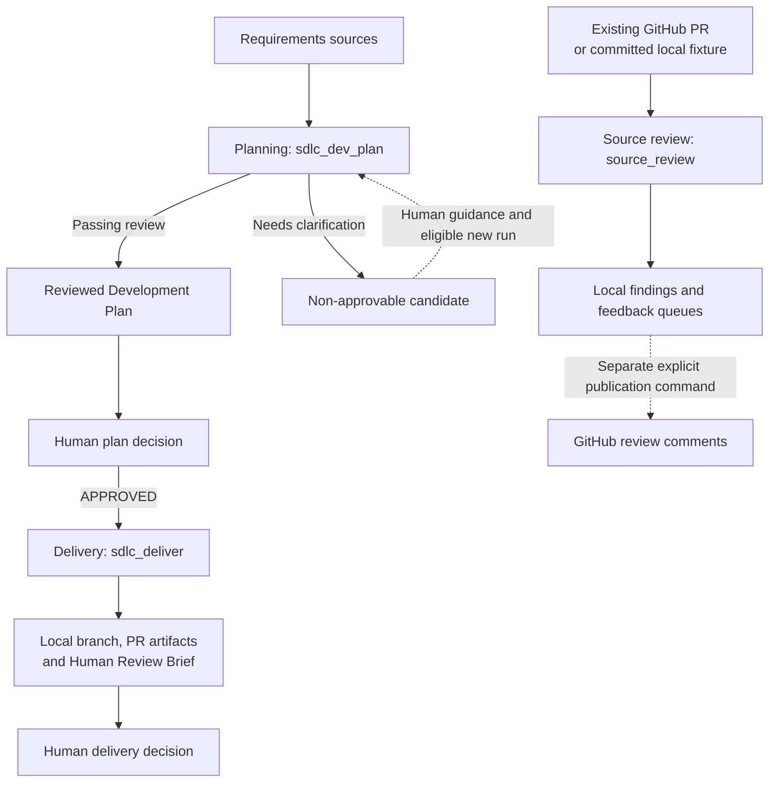
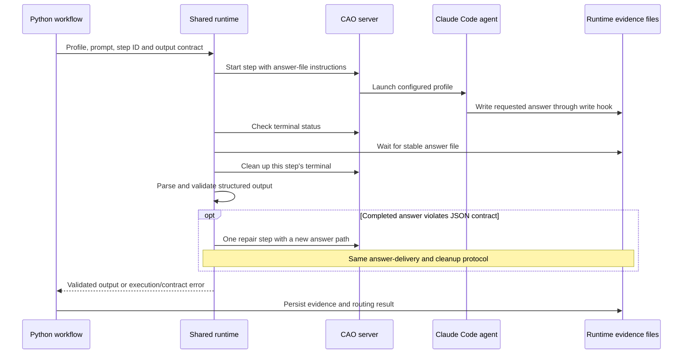
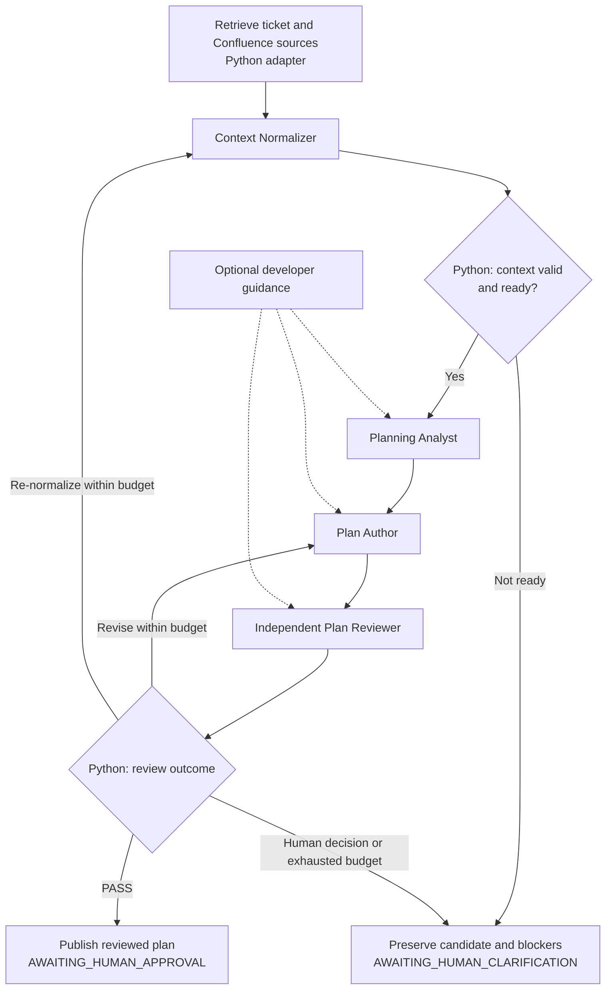
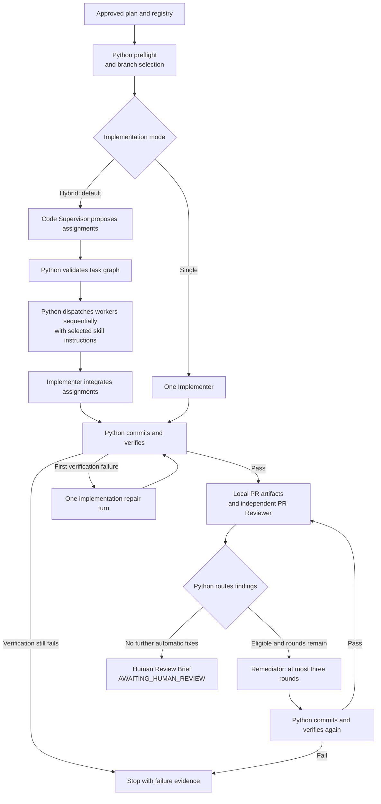
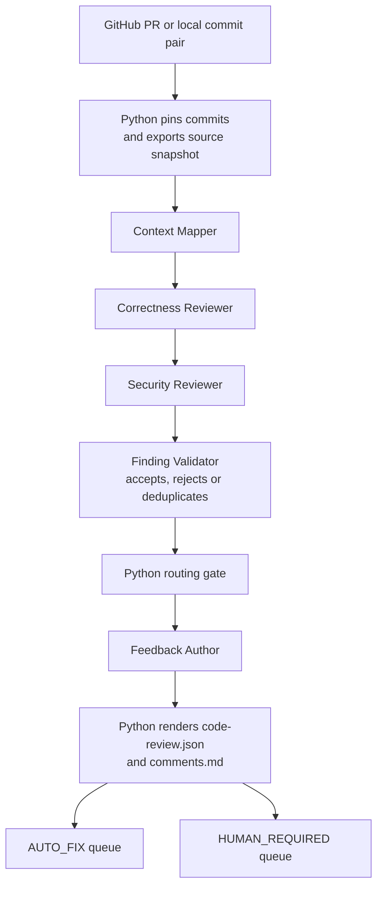
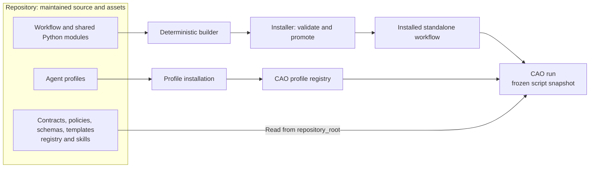

# Agentic SDLC architecture on AWS Labs CAO

This guide describes the implemented learning prototype as of **2026-09-21**. Workflow code and runtime contracts live in [`.agentic-sdlc/`](../.agentic-sdlc/); this directory holds project documentation. Start with the [root README](../README.md) for installation and commands.

## System overview

Python owns workflow order, validation, persistence, Git operations and verification. CAO runs the agent steps through the `claude_code` provider. Agents produce analysis, plans, code or findings; Python checks their outputs and chooses the next stage. Humans record approval separately.

Planning and Delivery share ticket-level records. Source review is independent: it needs no approved plan or delivery manifest. Its `AUTO_FIX` queue describes eligible work for a later consumer; it does not trigger Delivery or apply fixes. Delivery itself creates local PR artifacts and does not push, open a remote PR or merge.

## Execution components

The maintained modules are under [`.agentic-sdlc/cao/sdlc_workflows/`](../.agentic-sdlc/cao/sdlc_workflows/):

| Component | Responsibility |
|---|---|
| `planning.py`, `delivery.py`, `source_review.py` | Workflow inputs, domain contracts, routing and orchestration |
| `hybrid.py` | Specialist registry, supervisor assignments, sequential workers, skill injection and verification-suite selection |
| `runtime.py` | CAO steps, answer-file delivery, completion checks, bounded JSON repair and terminal cleanup |
| `artifacts.py`, `validation.py`, `errors.py` | Evidence files, digests, validation helpers and error types |
| `source_config.py` | Source-root and write-profile validation used by Delivery; the hook carries a standalone copy checked by parity tests |

The common agent-step protocol is shown below. Each workflow supplies its profile, prompt and output contract; it retains its own domain policy. In particular, Delivery and Source Review use different finding-routing rules.

The answer file is the response channel; terminal text is not treated as the final structured answer. An incomplete execution is distinguished from a completed but malformed JSON response. Agents do not launch other agents, run verification or manage Git; the Python workflow does that work.

## Implemented workflows

### Planning: requirements to a reviewed plan

The retrieval adapter copies local fixtures by default. The optional `jira_confluence_live` adapter fetches remote sources through Python; it has been tested against a fake HTTP server, not a real Atlassian tenant.

Only a `PASS` review publishes a plan for approval. Later reviews must account for earlier blocking findings. Developer guidance reaches the analyst, author and reviewer; it does not rewrite the normalized source requirements.

Non-converged candidates preserve the plan, context, analysis, reviews and digests available at the stop point. An eligible `resume_from` starts a **new run** from that evidence, with a fresh review budget. It checks the baseline, retrieved sources and candidate integrity; context-readiness stops require a cold run. See the [Planning guide](workflows/planning.md) for guidance authority and warm-start conditions.

### Delivery: approved plan to a reviewed branch

Delivery checks the plan approval and configured source roots, then creates or continues `sdlc/<ticket>`. A new branch starts at the current base-branch tip; the approved baseline must be an ancestor of that tip. The default hybrid mode uses a supervisor and registered workers. `implementation_mode=single` uses one implementer.

The supervisor proposes 1–16 ordered assignments; Python validates worker names, skills and dependencies before dispatch. Workers execute one at a time in the same checkout, each in a fresh session. The integration pass checks the whole feature. There is no parallel worker scheduler or per-run delivery worktree.

[`specialists.json`](../.agentic-sdlc/cao/specialists.json) connects workers to profiles, skills and verification suites. Hybrid verification uses the deduplicated union of selected worker and skill commands; single mode uses the `application` suite. Python runs commands without a shell, with timeouts, and repeats verification after repair or remediation. The registry currently ships one general `developer` worker and AngularJS/Spark skills; those skill suites need their own project files and toolchains.

Protected or high-impact findings go to human handling. Exhausting automatic remediation also leads to a brief with unresolved findings, and so does a remediation round that changes nothing: its findings are escalated to the human. Some exceptions currently end the CAO run as `failed` without updating the manifest to `BLOCKED`; the [Delivery guide](workflows/delivery.md) documents those outcomes. See [hybrid delivery](workflows/hybrid-delivery.md) for extension procedures.

### Source review: an independent PR snapshot

Source Review pins commits in a private object store and exports base/head source as plain files into a run workspace. It does not check out the PR in the developer's working tree. Local fixture mode supplies a repository and commit SHAs instead of a GitHub URL.

The arrows show execution order. Correctness and security reviewers have separate contexts and are instructed not to consult each other's findings; the validator considers their combined candidates. Source review reads code and test source but does not run tests, establish requirements compliance or approve the PR. GitHub mode checks the remote base/head again at completion and marks changed snapshots `STALE`. Publication is a separate explicit action. See the [Source-review guide](workflows/source-review.md).

## Build and deployment boundary

Repository modules are the maintained source. The builder follows each workflow's dependency graph and emits one standalone Python script, including a literal `INPUTS` declaration and `SDLC_BUNDLE_MANIFEST` with module digests. The installer validates the candidate through CAO before promoting it.

CAO snapshots the entry script, not its Python import tree, so local entry points must not be copied directly into the workflow installation directory. Bundling preserves the workflow code when that script is relocated or replayed. It does **not** freeze every external asset or make every workflow resumable; Source Review refuses reuse of an existing run directory, and Planning warm starts use new runs.

Python edits require rebuilding and reinstalling affected bundles. Profile edits require profile reinstallation. Repository assets such as the registry, skills and contracts remain outside the bundle and are read by subsequent runs. Planning and Delivery profiles are installed separately before their workflows; Source Review's installer includes its five profiles and refuses to overwrite an existing installation. See [build and install](build-and-install.md).

## Layout and evidence lifecycle

Tooling, project data and detailed execution evidence have separate locations:

| Path | Contents and lifecycle |
|---|---|
| `.agentic-sdlc/cao/` | Maintained modules, local entry points, builder, installers, profiles, registry and skills |
| `.agentic-sdlc/contracts/`, `policies/`, `schemas/`, `templates/` | Runtime contracts and supporting assets; templates also include the human approval and review-brief formats |
| `.agentic-sdlc/scripts/` | Human-decision recorders and optional source-review publisher |
| `.claude/settings.json`, `.claude/hooks/restrict-write-scope.py` | Repository write-hook wiring and enforcement |
| `agentic-sdlc-records/<ticket>/` | Durable plans, guidance, reviews, approval records and manifests, intended for Git; outside the embeddable tooling directory |
| `agentic-sdlc-records/<ticket>/candidates/<run-id>/` | Non-approvable planning snapshots and human-needed reports |
| `.agentic-sdlc/runtime/<ticket>/<run-id>/` | Planning/Delivery answers, raw output, dispatch and verification logs; Git-ignored |
| `.agentic-sdlc/runtime/source-review/<run-id>/` | Source-review object store, workspace, report and optional publication receipt; Git-ignored |
| `agentic-sdlc-local-inputs/` | Requirements fixtures, demonstration records and source-review fixture generator |
| `agentic-sdlc-docs/` | Guides, reference material and dated verification records |
| `app/`, `tests/` | Payment-service example and workflow test suites, respectively |

Planning publishes a reviewed plan, review and execution manifest; human approval adds `plan-approval-record.json`. Delivery adds its manifest, local PR artifacts, review rounds and Human Review Brief; the human decision adds `pr-approval-record.json`. Earlier decisions on superseded delivery heads are archived under `approval-history/`.

Source-review evidence stays entirely in its run directory: archive the whole directory when durable retention is needed. Legacy checkouts may still use `docs/`, `examples/`, `sdlc-records/` or `.agentic-sdlc/records/`; current code uses the paths above.

## Enforcement and human authority

The profiles request one answer file per step. **The current hooks enforce a broader runtime-directory boundary**, not exclusive ownership of that answer file:

| Actor | Current enforced agent-tool write scope |
|---|---|
| Planning agents, code supervisor, PR reviewer | Repository `.agentic-sdlc/runtime/**` |
| Implementer, remediator and registered source-writing workers | Runtime tree plus configured source roots, narrowed by `write_profiles` where configured |
| Source-review agents | `.agentic-sdlc/runtime/**` inside the isolated workspace; exported source and other workspace files are protected |

The repository hook uses CAO terminal metadata and the trusted registry to grant source writes. Invalid source-root configuration denies source writes; the runtime answer area remains writable. The hook intercepts Claude write/edit tools and applies to CAO worker sessions. It does not sandbox Python orchestration or application code executed by verification. See the [profile reference](reference/agent-profiles.md) and [hook reference](reference/write-scope-hook.md), read alongside these current limits.

Humans use [`approve_plan.py`](../.agentic-sdlc/scripts/approve_plan.py) to record a decision bound to the reviewed plan digest, baseline and any guidance. [`record_pr_approval.py`](../.agentic-sdlc/scripts/record_pr_approval.py) binds the delivery decision to the exact reviewed local branch head. These scripts record supplied human decisions; they do not authenticate a remote GitHub review. Agents cannot approve plans or PRs through the workflow.

The [hardening plan](../hardening-plan.md) proposes exact answer-file authorization, stronger baseline-drift checks and consistent protection of pre-existing local changes. They are not implemented guarantees. At present:

- Baseline ancestry does not establish that intervening changes preserve the plan's assumptions.
- Clean-source and empty-index checks are enforced for hybrid mode, not consistently for single mode. Delivery requires exclusive use of its checkout; concurrency isolation is not enforced.
- Planning does not consume configured source roots, so a human must check that approved tasks fit Delivery's write scope.
- Verification executes agent-editable application code and tests on the host without a dedicated sandbox.

The [future-versions assessment](../future-versions.md) records remaining gaps and deferred capabilities. Tests cover source and bundled execution, hooks, approval and integration paths; real CAO checks and their limits are documented separately in the [verification records](README.md#verification-records).
