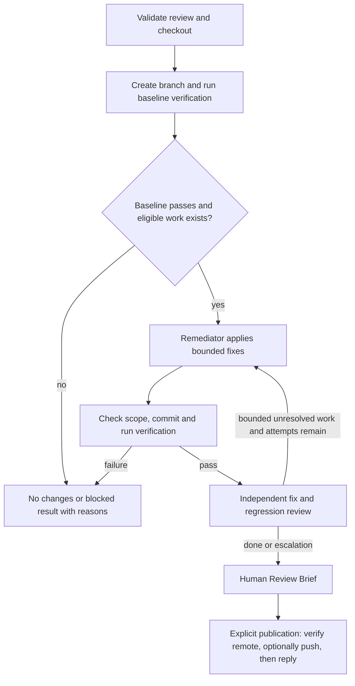

# Plan: remediate source-review findings

Status: **approved and implemented in the isolated `feature/source-remediation` worktree**.
Prepared 2026-10-01 against `f3c8103`; implementation started from `8bc6985` in a separate worktree.
The user approved implementation and the flat records layout, with no merge until explicitly authorized.
Automated validation and remaining live/deployment checks are recorded in
[the verification record](../verification/source-remediation.md). No live GitHub publication is implied.

## 1. Purpose

Add a slim, ticket-independent workflow that fixes eligible comments generated by `source_review`.
Keep Source review read-only. Reuse Delivery's agent execution, remediator, configured write boundaries,
verification and evidence conventions. After every change, independently check the fix and the resulting
PR diff. Stop with a Human Review Brief and an optional route to publish verified fixes and GitHub replies.

The input is the structured finding behind each generated comment, including its evidence and routing.
Plain Markdown or arbitrary GitHub comments cannot establish eligibility. No Jira ticket, approved
Development Plan, supervisor, specialist dispatch or initial feature implementation is required.

## 2. Current implementation and implications

- `source_review` emits `code-review.json`, `comments.md` and `review-draft.md`. Each finding has a stable
  ID, location, evidence, suggested verification and deterministic `AUTO_FIX`/`HUMAN_REQUIRED` routing.
- Delivery already has the remediator, command runner, bounded fix loop, independent review and final
  brief. Its entry point, reviewer prompt, branching, records and approval checks assume a ticket/plan.
  Its finding schema and eligibility thresholds also differ from Source review's.
- The existing `sdlc_remediator` has the necessary source-write permissions. Its profile currently
  assumes an approved plan; that input must become conditional on the invoking workflow's contract.
- Governance invariants 1 and 15 currently require a plan/ticket for implementation and traceability.
  A documented alternative authorization and provenance contract is required, not a fake ticket or plan.
- The workflow builder flattens imports and rejects conflicting globals. Importing all of `delivery.py`
  or `source_review.py` would introduce multiple `INPUTS` and `main` definitions. Extract reusable helpers.
- The source-review publication receipt stores comment IDs, bodies and locations, but not an explicit
  stable-finding-ID to GitHub-comment-ID map. Reliable replies need that map.
- Delivery currently performs at most two remediation batches because its review counter starts at one
  and the loop tests `< 3`. The new workflow will explicitly count fix attempts, capped at three; changing
  Delivery's existing counting behavior is outside this change.

## 3. Proposed decisions

| ID | Decision | Reason |
|---|---|---|
| D1 | Registered workflow **`source_remediate`**, module `source_remediation.py`, installer `install_source_remediate.sh`. | Pairs with the existing `source_review` name and uses the existing build/install approach. |
| D2 | Consume a source-review run directory; default to all canonically eligible findings, with an optional explicit selection file. | Accepts the generated comments without reconstructing policy from prose. |
| D3 | Work from the exact reviewed HEAD on a new local branch `sdlc/source-remediate/<run-id>`. Require a clean checkout and exclusive use of it. | Preserves SHA binding and follows Delivery's local branch model without tickets or parallel worktrees. |
| D4 | Reuse **`sdlc_remediator`**; add one read-only **`sdlc_source_fix_reviewer`** profile. | Keeps the workflow to two agent roles. The new reviewer checks fixes without assuming an approved plan. |
| D5 | Keep Source review's stricter eligibility policy. New findings discovered during remediation are escalated in v1. | Bounds the run to the original authorized findings and prevents policy dilution or expanding scope. |
| D6 | Baseline verification, then fix → commit → verification → independent review; at most three fix batches. | Follows Delivery's remediation phase. A failed verification after a fix stops the run. |
| D7 | A finding becomes `FIXED` only with passing verification and an explicit independent resolution decision at the final candidate HEAD. | Neither a fixer claim nor disappearance from a fresh findings list proves resolution. |
| D8 | **Separate publication confirmed by the user:** local workflow, followed by `publish_source_remediation.py` with preview and explicit publication. Proposed optional `--push` pushes the verified candidate before replying. | Publication happens after the human reviews local fixes, matching the existing separation of local work and explicit GitHub publication. |
| D9 | GitHub “done” means a reply stating the fix commit and verification. Leave thread resolution and PR approval to the reviewer. | Makes the result visible without treating automated fix verification as human acceptance. |
| D10 | Preserve all original `HUMAN_REQUIRED` findings and exclusions in the final brief. Verified partial results may be published only if the final candidate has no introduced regression or scope violation. | A successful local correction must not hide outstanding human work. |
| D11 | Use one durable records folder `source-remediation/pr-<number>-<run-id>/`. Without a PR, use `source-remediation/local-<sha12>-<run-id>/`. | Keeps the PR visible and attempts distinct without deep nesting; full repository/review identity lives in the manifest (user feedback, 2026-10-01). |

## 4. Workflow contract

### Inputs

| Input | Required | Meaning |
|---|---|---|
| `repository_root` | yes | Existing, operator-configured checkout containing the reviewed commit and trusted workflow tooling. |
| `review_directory` | yes | Completed Source review run containing `code-review.json` and the original mapping/validation evidence. |
| `selection_file` | no | Human-owned JSON with an explicit list of selected finding IDs and optional excluded IDs/reasons. Without it, select all eligible findings. |

Use `CAO_WORKFLOW_RUN_ID` and the existing safe-component validation. No ticket or PR URL input is
needed: PR identity comes from the report. Fixture reports work locally; GitHub publication requires
a report tied to a GitHub PR. The maximum of three fix batches is a policy constant in v1.

`selection_file` can narrow eligibility, never promote `HUMAN_REQUIRED`. Reject unknown or duplicate
IDs, conflicting selections and a selected ineligible finding. Preserve explicit requests for human
judgment as exclusions. A draft's `publish=no` controls publication, not fix authorization; do not
silently treat it as a fix selection. Edited `review-draft.md` text is not executable remediation input.

### Preflight and authorization

1. Exclusively create the ignored runtime directory and checkout lock. Reject an existing run/branch rather
   than resetting it or consuming old agent answers. Record failure evidence even if no agent can start.
2. Validate report schema/policy version, `status == REVIEWED`, unique IDs, finding contracts, queue
   consistency and original mapping/adjudication evidence. Recompute Source review routing; do not trust
   an edited queue. Record digests of all consumed evidence and the selection. Digests bind the run to
   its inputs; they are not signatures proving who created a report.
3. Require local `HEAD == snapshot.head_sha`. Verify the pinned base/merge-base objects and the reviewed
   source/diff against Git, including deletions. For GitHub inputs, confirm the PR is open and both tips
   still match the source report. A moved PR requires a new Source review, even if individual lines match.
4. Validate source roots and the effective `sdlc_remediator` write roots, registry verification commands,
   hook installation and required profiles. Findings that cannot be fixed/tested within the configured
   write boundary are escalated; never widen permissions automatically.
5. Require an empty index and no tracked changes or non-ignored untracked files. Acquire a checkout-wide
   remediation lock; reject concurrent remediation. Exclusive checkout use remains an operator requirement
   across other workflows until shared locking is implemented.
6. Record coverage gaps. `INCOMPLETE` alone does not reject every finding: the independent reviewer must
   establish resolution from available source and tests. Missing context needed for a particular fix
   causes escalation. An unassessable candidate cannot be declared safe to publish.
7. After the clean-checkout checks, create durable records and record an immutable run authorization binding
   report digest, repository/PR, reviewed HEAD and selected
   IDs. Explicit invocation authorizes bounded attempts under this contract; eligibility alone does not
   launch work. Governance will state this alternative while preserving Delivery's plan-approval gate.

Tooling is the operator's trusted, configured checkout, as with Delivery. Do not clone an arbitrary
reviewed PR and execute its hooks or verification configuration without establishing that trust.
Record tooling/configuration digests and refuse changes to them during the run. This workflow executes
project tests; it inherits Delivery's host-execution limitation and is not a sandbox for hostile PRs.

### Steps and correspondence with Delivery

| Delivery step | Source remediation |
|---|---|
| Validate approved plan | Validate review, policy, selection, exact source identity and invocation authorization. |
| Create delivery branch | Create `sdlc/source-remediate/<run-id>` at the reviewed HEAD. |
| Implement plan | Remediator fixes only selected comments and adds focused regression coverage as needed. |
| Run verification | Run the configured application suite before changes and after each fix commit. |
| Write local PR artifacts | Write the cumulative repair diff, candidate commit and finding outcomes for the existing PR. |
| Independent PR review | Review the resulting full PR diff, the repair-only diff and every selected failure scenario. |
| Bounded remediation | Retry only eligible unresolved selected findings, with an explicit remaining-work decision. |
| Human Review Brief | Present verified fixes, skipped/escalated comments, coverage gaps and publication instructions. |
| Human decision | Human reviews the candidate; an explicit publisher can update the PR and post done replies. |

Sequence:



Use one sequential batch at a time; no supervisor, workers or integration pass. The baseline suite must
pass before editing, otherwise record `BLOCKED` and preserve the baseline failure. An empty selection
returns a `NO_CHANGES` result without launching agents or claiming any finding was fixed.

After each batch, Python checks the complete changed-path set, including removed files, against the
effective allowed roots before staging. Reject unrelated/protected edits and unexpected staged content.
Stage only validated paths, including deletions, then check the staged diff before committing. This avoids
blindly inheriting Delivery's broad staging helper or its deleted-root edge case.

Record one commit per batch, with run identity and addressed finding IDs. Verification uses trusted
registry commands, never commands parsed from comments or generated by the remediator. Suggested
verification in a finding informs regression-test changes and reviewer checks; it is not shell input.
Pin the candidate SHA and assert verification/review have not changed tracked source or configuration.

### Independent review and convergence

The new reviewer has the same read-only permissions pattern as the existing `sdlc_source_*` profiles.
It receives the original findings, mapping, coverage gaps, source at the reviewed and candidate commits,
full PR diff, cumulative repair diff, verification evidence and earlier resolution decisions.

Require exactly one result for every selected original ID on every review, including findings marked
fixed in earlier rounds: `FIXED`, `UNRESOLVED` or `HUMAN_REQUIRED`, with source/test evidence and a reason.
For `FIXED`, explain why the original failure scenario is prevented and which verification supports it.
Separately report introduced defects, scope deviations, weakened tests and unresolved coverage limitations.
Unknown/missing IDs or malformed evidence trigger the existing bounded JSON contract repair, not success.

Python binds the decision to the actual candidate SHA. New findings are reported for human action; an
introduced regression or material scope violation blocks publication of that candidate. Existing unrelated
human findings remain visible but do not by themselves invalidate a verified bounded fix.

Allow another batch only for original selected findings still eligible, with a concrete bounded next step.
Escalate no-change attempts, repeated no-progress failures, reopened fixes, ambiguous behavior, expanded
scope, missing necessary verification and exhausted attempts. A failed verification after a batch stops
immediately, matching Delivery's remediation behavior; do not add Delivery's initial implementation-repair
turn to this loop. Preserve failed commits and evidence for inspection.

States follow existing conventions: `READY → REMEDIATING → VERIFIED → AGENT_REVIEWING`, repeating when
needed, then `AWAITING_HUMAN_REVIEW`; exceptions are `BLOCKED` and `FAILED`. `NO_CHANGES` is a separate
successful outcome. Per-finding status and publication status are separate from workflow state.

## 5. Reuse and code organization

| Existing component | Planned use |
|---|---|
| `runtime.py` | Reuse agent dispatch, stable answers, explicit step IDs, JSON contract repair and terminal cleanup. |
| `artifacts.py`, `validation.py`, `source_config.py` | Reuse artifact/validation helpers and source-root/profile rules. |
| Delivery `_run_verification` | Extract with its timeout into a shared `verification.py`; keep Delivery's behavior and evidence format. |
| Delivery remediator completion validation | Extract into a small shared `remediation.py`; retain existing Delivery prompt/policy behavior. |
| `sdlc_remediator` profile | Accept either an approved-plan Delivery contract or an authorized Source-remediation contract, named explicitly by the prompt. Tool permissions stay unchanged. |
| Source-review finding validation/routing | Extract entry-point-free policy helpers into `source_review_contracts.py`; both workflows use the same rules. |
| Existing PR reviewer conventions | Reuse profile structure and review-evidence conventions for `sdlc_source_fix_reviewer`, with a dedicated resolution contract. |
| Builder/installer and tests | Register `source_remediate`, bundle its dependency closure, validate/install its required profiles consistently. |

Keep workflow-specific orchestration, prompts, branch names and briefs separate. Reuse mechanics without
making Delivery's approved plan optional. Do not copy its orchestration wholesale or introduce a generic
workflow framework. Shared helpers must work in source and standalone bundled modes.

The fresh fix review is a dedicated independent review of the current candidate, not another invocation
of the five-agent Source review pipeline on every attempt. This keeps remediation slim. It must still
inspect the full resulting PR diff for regressions and explicitly account for each attempted fix.

The known broad runtime-answer write permission remains a separate hardening item in `hardening-plan.md`.
Keep canonical reports and decisions outside agent-writable runtime areas; do not describe prompt-only
answer ownership as enforced isolation. This plan does not silently claim to complete that hardening work.

## 6. Artifacts and traceability

Use one folder per remediation attempt, named with the PR number and run ID:

```text
agentic-sdlc-records/source-remediation/pr-<number>-<run-id>/
```

For example, PR #42 with run ID `fix-001` uses
`agentic-sdlc-records/source-remediation/pr-42-fix-001/`.
Records already live inside the working repository, so its name need not add path levels. The manifest
and brief retain the full GitHub repository/PR identity, original Source review run ID, report digest and
full reviewed HEAD. The run ID distinguishes attempts based on the same or different reviews of the PR.

For local fixture reviews without a PR, use:

```text
agentic-sdlc-records/source-remediation/local-<sha12>-<run-id>/
```

Derive the PR number from the validated report and the local short SHA from the validated full reviewed
HEAD. Validate the run ID and resulting folder name. Folder labels are for navigation; the manifest's full
identities and digests remain authoritative, including the PR's base repository for fork PRs. Refuse existing
run directories or identity conflicts rather than overwriting them.

Runtime agent answers and logs remain under `.agentic-sdlc/runtime/source-remediation/<run-id>/`.
The workflow emits the full durable records path for the human and publisher; neither must reconstruct it.

Durable artifacts:

- `remediation-manifest.json`: schema/policy versions, run and review identities, input/configuration
  digests, PR identity, base/merge-base/original HEAD, branch, current candidate HEAD, states and history.
- `authorization.json` and `selected-findings.json`: the exact bounded scope, exclusions and original routing.
- `fix-review-r<N>.json`: independent decisions and candidate SHA for every round.
- `remediation-diff.patch` and `human-review-brief.md`: cumulative changes, evidence and outstanding work.
- `publication.json`: push outcome, actual published HEAD and per-finding reply receipts/errors.

Bind verification summaries and reviewed changes to the candidate SHA and record their digests. Keep
original Source review artifacts unchanged. The brief distinguishes `FIXED` locally, `PUBLISHED` to the PR,
`DONE_COMMENTED`, and outstanding findings. No state is equivalent to PR approval.

## 7. GitHub publication and “done” replies

GitHub supports replies to a top-level inline review comment through
`POST /repos/{owner}/{repo}/pulls/{pull_number}/comments/{comment_id}/replies`.
Replies to replies are not supported. Use the original top-level comment ID.
See [GitHub's review-comment API](https://docs.github.com/en/rest/pulls/comments#create-a-reply-for-a-review-comment).

### Finding-to-comment mapping

Extend Source review publication to append a deterministic machine marker to each outgoing finding comment
after parsing the editable draft. Read back posted comments and store `finding_comments` in its publication
receipt, mapping stable ID to comment ID/URL and the publication review. Do not rely on editable title text,
line numbers or response order as identity. Keep existing audit artifacts immutable.

Verify the mapped comment belongs to the expected PR and publication before replying. For legacy receipts
without a reliable map, or a finding published in the general review body, post one PR conversation summary
listing the verified finding IDs, original review link where available, and fix commit. General PR comments
use the [issue-comment API](https://docs.github.com/en/rest/issues/comments#create-an-issue-comment).
Do not guess a thread. Do not publish previously omitted/unpublished review findings merely to announce a
fix; record that no original published comment exists and skip their GitHub notification.

### Publisher behavior

Proposed CLI: `publish_source_remediation.py <records-directory>`, read-only preview by default.
`--publish` sends the prepared replies only when the verified candidate is already the PR HEAD.
`--publish --push` additionally pushes that candidate to the existing PR head branch first.
`--push` alone is invalid. This supports both manual pushes and one explicit push-and-notify command.

1. Validate final manifest/review/verification evidence and hashes. Permit only the final verified candidate
   with no blocking introduced regression, scope violation or unassessable changes. Each reply requires a
   `FIXED` decision for that finding at this exact HEAD.
2. Re-fetch PR metadata; check open state, unchanged base, repository identities and head branch. With
   `--push`, require remote HEAD still equals the original reviewed HEAD, or already equals the candidate
   for a retry. Require the candidate to descend from the reviewed HEAD.
3. Resolve the destination from GitHub's actual head repository/ref, including forks. Do not assume `origin`
   is the PR branch. A missing/deleted branch or insufficient permission is an explicit publication failure.
4. Push only the candidate SHA to that exact existing ref with a normal fast-forward push. Never force-push,
   create another PR, overwrite another contributor's commits, or change branch protection.
5. Re-fetch and require PR HEAD equals the candidate before any done reply; repeat the current-head check
   before further replies. If the PR moves, stop and require new verification/review. Push and comments
   cannot be atomic; record partial publication and do not roll back a successful push.
6. Reply with concise evidence, for example: **“Done in `<commit>`: corrected the slice boundary. The
   configured verification suite passed and an independent review confirmed this finding is fixed.”**
   Link the commit; do not claim CI or human approval. Do not expose local absolute paths.
7. Persist each reply ID/URL and a deterministic idempotency marker based on original review, finding ID
   and verified commit. Before posting, search existing comments (with pagination) for the exact marker.
   Recover after a lost response/receipt without duplicate replies. Use an exclusive publication lock;
   an ambiguous network failure requires checking remote state before retrying, not blind reposting.

If notification fails after a push, retain verified local results and record publication as incomplete.
Retry only outstanding notifications. A moved base/HEAD invalidates new notifications even if earlier replies
were already posted. Do not delete historical replies. Network/API work is performed by Python, not agents.

“Done” is a comment, not a GitHub review state. Automatic thread resolution is excluded from v1: it is a
separate action with consequences for required conversation resolution. Human approval, merge, editing
other people's comments and changing review verdicts remain outside this workflow.

## 8. Implementation milestones

1. **Contracts and focused extraction.** Add the remediation contract/policy and explicitly scope governance
   authorization/traceability. Extract shared verification, completion and source-review policy helpers.
   Existing Delivery and Source review behavior must remain unchanged under regression tests.
2. **Local workflow.** Add inputs, preflight, run authorization, branch/commit checks, baseline verification,
   remediator dispatch, durable manifests and failure handling. Register/build/install the new workflow.
3. **Independent review and loop.** Add the read-only fix reviewer, strict resolution accounting, final-SHA
   checks, bounded retries/escalation and Human Review Brief. Extend read-only profile protections/tests.
4. **GitHub integration.** Add stable comment mappings to the existing publisher and the new preview/publish
   tool, optional fast-forward push, notifications, concurrency checks and recovery receipts.
5. **Verification and documentation.** Run source/bundle suites, isolated CAO fixture checks and a disposable
   GitHub test PR exercise. Document usage, statuses, trust assumptions, installation and recovery.

Expected files: new `sdlc_workflows/source_remediation.py`, the shared modules above, workflow entry point
and installer; `profiles/source-fix-reviewer.md`; updates to `profiles/remediator.md`, builder/installer,
governance and profile references; `scripts/publish_source_remediation.py` and the existing publisher;
new `agentic-sdlc-docs/contracts/source-remediation-workflow.md`, policy, workflow guide and verification
record; focused new tests plus existing Delivery, Source review, source-config and packaging tests.
Update README, architecture and documentation indexes with the new workflow and handoff.

Coordinate changes to `delivery.py` with the separate parallel-hybrid-workers plan. Do not implement its
parallelism or broader hardening here. Upgrade affected installed bundles/profiles together when their
runs are idle; verify installed artifacts match the reviewed source.

## 9. Acceptance and validation

### Automated checks

- Valid eligible comments are selected; stale/failed reports, malformed contracts, unknown IDs, modified
  routes, wrong repositories/SHAs and incompatible policy versions are refused before agents edit source.
- LOW/MEDIUM eligibility retains Source review's >=0.90 threshold and every required condition; protected
  or human-directed work cannot be promoted through selection or schema conversion.
- Empty selection, dirty source/index, untracked collisions, existing branch/run and concurrent invocation
  preserve the user's files and produce actionable outcomes.
- Records use the flat PR/run naming scheme and retain full repository/review identity in the manifest.
  Cover fork PR identity, local fixture fallback, unsafe names and refusal to overwrite existing records.
- Real temporary Git repositories cover additions, deletions (including an entire source root), path
  escapes, staged unrelated changes, changes outside allowed roots and unexpected HEAD/configuration drift.
- Baseline failure blocks; every changed candidate is verified and independently reviewed; command failure,
  timeout and agent-contract failure never become successful fixes.
- A fixer claiming success while the defect remains is `UNRESOLVED`; absence from a findings list is not
  `FIXED`. Every selected ID, including previously fixed IDs, is reassessed at the final candidate HEAD.
- Human findings stay visible; introduced regressions and material scope changes block publication;
  no-change, no-progress, reopened and exhausted attempts escalate; at most three fix batches run.
- Publication covers stable mapping, edited drafts, legacy/general fallback, omitted comments, wrong PR,
  missing thread, fork destination, no push permission, moved base/HEAD and non-fast-forward rejection.
- No done reply before the exact verified commit is the PR HEAD. Test interrupted push/notification,
  lost responses, retry deduplication and per-comment receipts. Endpoint tests prohibit approval, merge,
  comment deletion/editing and thread-resolution operations.
- Source/bundle parity and installed-profile permissions remain intact. Existing workflows retain their
  inputs, policies, outputs and behavior after extraction.

Run the complete repository suite in both supported modes after the shared changes:

```bash
python3 -m unittest discover -s tests
SDLC_TEST_SOURCE=1 python3 -m unittest discover -s tests
```

### Live checks

Use a disposable configured repository with one local eligible defect and one protected finding. Confirm
the eligible finding is fixed, focused coverage is added, verification passes, independent review confirms
the resolution, and the protected finding remains human work. Record commits, run IDs, evidence and limits.

On an explicitly designated draft test PR, publish the original review, run remediation, inspect the preview,
then exercise push-and-notify and retry. Confirm one done reply on the correct comment, correct commit link,
no duplicate notification and no approval, merge or thread resolution. Also exercise the general-comment
fallback. Keep live-test publication separate from approval of this design.

## 10. Review points

These review points were accepted before implementation; separate publication (D8) and the flat directory
layout (D11) were explicitly confirmed:

1. `source_remediate` naming and structured source-review input, with optional finding selection.
2. Two-agent design: existing remediator plus a dedicated independent fix reviewer.
3. Optional push in the separate publication command, and a done reply without resolving threads.
4. Three bounded fix attempts, with new findings escalated instead of expanding the autonomous task.

Implementation is confined to the separate worktree. Shared installed profiles/workflows were not upgraded,
and no GitHub mutation or merge has been performed. The dedicated fix reviewer provides fresh independent
review at each local candidate; it does not rerun the five-agent Source review pipeline on every attempt.
