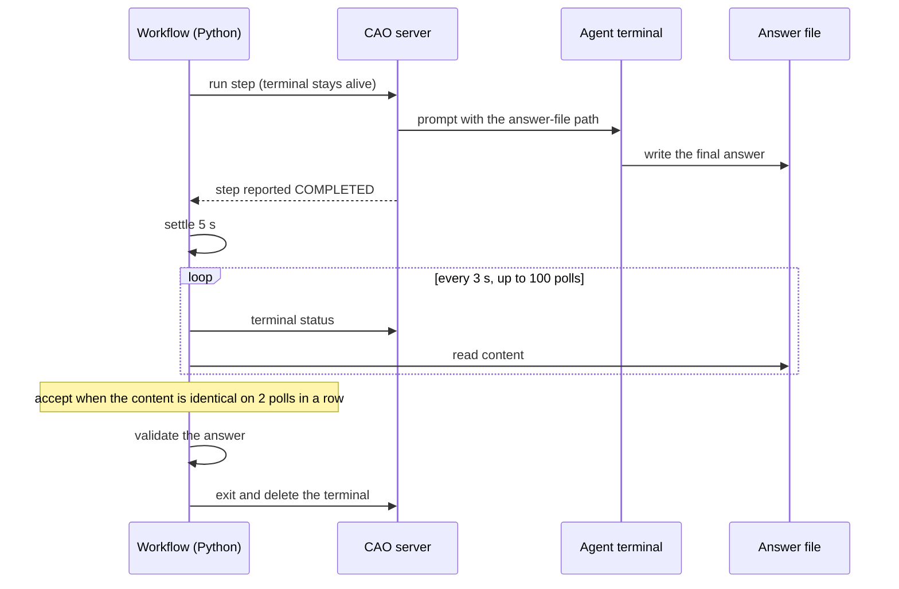
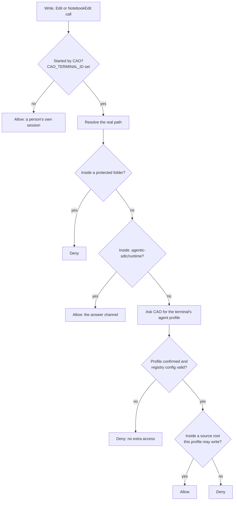

# Agent answers and write scope

All three workflows work the same way at the boundary between Python and the agents: an agent returns its
result by **writing a file**, and a repository hook decides which files any agent may write. This page is the
authoritative description of both. It is a security design, so keep it in step with the code it names.

## At a glance

| Concern | Mechanism |
|---|---|
| How an agent returns its result | It writes one answer file under `.agentic-sdlc/runtime/`; Python reads and validates it. |
| What confines the agents | A `PreToolUse` hook, `.claude/hooks/restrict-write-scope.py`, wired in `.claude/settings.json` on `Write`, `Edit` and `NotebookEdit`. |
| Who is writing | The hook asks CAO's own terminal metadata for the terminal's agent profile; nothing the agent says about itself is trusted. |
| What can be configured | The project's source roots and which profiles may write them, in `.agentic-sdlc/cao/specialists.json`. |
| Failure behaviour | Closed: anything unknown or invalid grants no extra access. |

## How a step returns its answer

Reading text from a terminal screen is not a reliable completion signal: CAO can report a worker as
`COMPLETED` while Claude Code is still working, and the screen is a redrawn TUI, not a transcript. So every
step tells the agent to write its final answer to a specific file and the workflow waits for that file.

- A terminal in `error` or `waiting_user_answer` is rejected at once: headless agents must never wait for a person.
- If the file never appears or never stabilizes, the step fails as **incomplete execution**. That is never sent
  for JSON repair, so a lifecycle problem is not mistaken for a formatting problem.
- If the content is stable but is not valid JSON or does not match the contract, the agent gets **one**
  repair turn and the result is validated again.
- Each step's evidence is kept under `.agentic-sdlc/runtime/<ticket>/<run-id>/`: the answer file, the accepted
  raw content and a stabilization log with the polls.
- A step that has not finished after 30 minutes fails.

## Why a hook

Agents need `fs_write` to deliver answers. CAO maps `fs_write` to Claude Code's `Edit`, `Write` and
`NotebookEdit` tools as a whole category; it cannot scope the grant to one path. Claude Code's own
`permissions.allow` and `deny` path rules do not help either, because CAO launches these workers with
`--dangerously-skip-permissions`, which skips the permission layer entirely.

Hooks are a separate layer and are not skipped by that flag. That makes the hook the actual enforcement, and it
matters because the planning and review agents read **untrusted external content** (Jira and Confluence text, or
a pull request's source). A prompt-injection payload in that content could try to make an agent write or
overwrite an arbitrary file. The hook stops that no matter what the agent is tricked into attempting.

## What the hook decides

Protected folders are never writable, for any profile: `.git`, `.claude`,
`.agentic-sdlc/cao`, `.agentic-sdlc/policies`, `.agentic-sdlc/contracts`, `.agentic-sdlc/templates`,
`.agentic-sdlc/schemas` and `agentic-sdlc-records`. A widened profile therefore cannot rewrite its own guardrails,
the registry or a published record.

## Who may write what

| Role | Writable |
|---|---|
| Planning agents, the code supervisor, the PR reviewer | Only their answer file under `.agentic-sdlc/runtime/` |
| Implementer, remediator, and any worker profile listed in `write_profiles` | The answer file, plus the configured source roots |
| Source-review agents | Only the answer area of the run's isolated workspace, through a hook generated for that workspace (see [source review](../workflows/source-review.md)) |
| Nobody | The protected folders above |

## Configurable source roots

The directories that implementers may write are configuration, not code. They come from two keys in the
trusted registry, `.agentic-sdlc/cao/specialists.json`:

- `source_roots`: the directories (default `["app"]`);
- `write_profiles`: which profiles may write them, each with all roots or a subset (default: implementer and remediator, all roots).

The hook reads the registry when it decides on widening and validates it every time. The rules:

- **Invalid means no access.** A registry that is present but unreadable, malformed or invalid grants no extra
  access to any profile. It never falls back to the defaults. A missing registry or missing keys use the defaults.
- **Roots cannot escape.** A root must be a relative, normalized path with no `..`, glob characters or `:`
  (which git treats as pathspec syntax), and must not overlap the protected folders. A root whose real path
  leaves the repository, for example through a symlink, invalidates the whole configuration.
- **Read-only roles cannot be listed.** The supervisor, the reviewers, and the planning and source-review
  profiles can never appear in `write_profiles`.
- **New modules are fine.** A root may name a directory that does not exist yet.
- **The registry is protected.** It sits under `.agentic-sdlc/cao`, so no agent can edit it.

Delivery validates the same rules before any agent starts, so a bad configuration stops the run instead of
surfacing as denied writes. See [Delivery](../workflows/delivery.md#configuration).

## Where it lives

| Part | File |
|---|---|
| The hook, including its standalone copy of the validator | `.claude/hooks/restrict-write-scope.py` |
| Hook wiring | `.claude/settings.json` |
| The validator used by Delivery (bundled into the workflow) | `.agentic-sdlc/cao/sdlc_workflows/source_config.py` |
| Answer-file protocol and JSON repair | `.agentic-sdlc/cao/sdlc_workflows/runtime.py` |
| Trusted configuration | `.agentic-sdlc/cao/specialists.json` |

## Tests

- `tests/test_restrict_write_scope.py` runs the hook as a real subprocess, exactly as Claude Code fires it, and
  covers non-CAO sessions, in-scope and out-of-scope writes, path traversal, absolute paths, both `file_path` and
  `notebook_path` inputs, and the answer-path shapes the workflows build. It also holds the configuration matrix:
  multiple roots, narrowed profiles, missing and broken registries, and symlinked roots.
- `tests/test_source_config.py` runs one corpus of valid and invalid configurations through the workflow's validator
  (source and bundled forms) and through the hook's copy, so the two cannot drift apart.

Run both whenever the hook, the answer-path layout or the validator changes.

## If you change any part of this

- Removing `fs_write` from a profile means changing how that step delivers its answer; do not fall back to
  reading terminal text.
- Narrowing or removing the hook reopens the write-scope gap described above. Keep an equivalent restriction.
- Do not rely on `permissions.allow` or `deny` rules as a substitute; they do not apply to these workers.
- Keep `validate_source_config` in the hook and in `source_config.py` identical in behaviour, and never let an
  invalid configuration fall back to the defaults.
