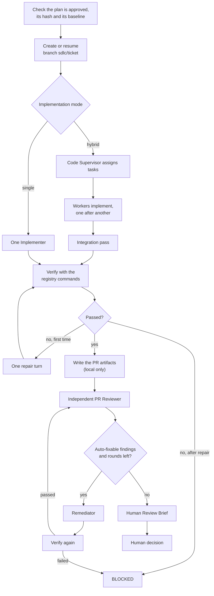
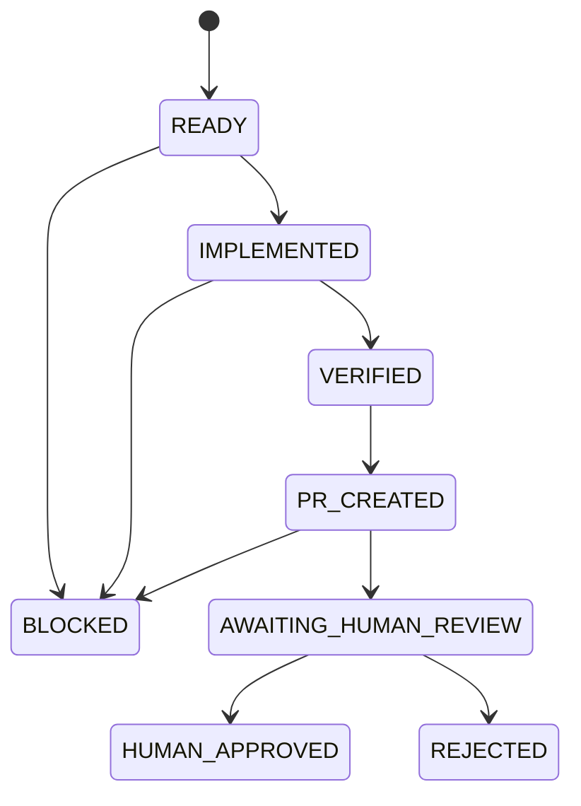
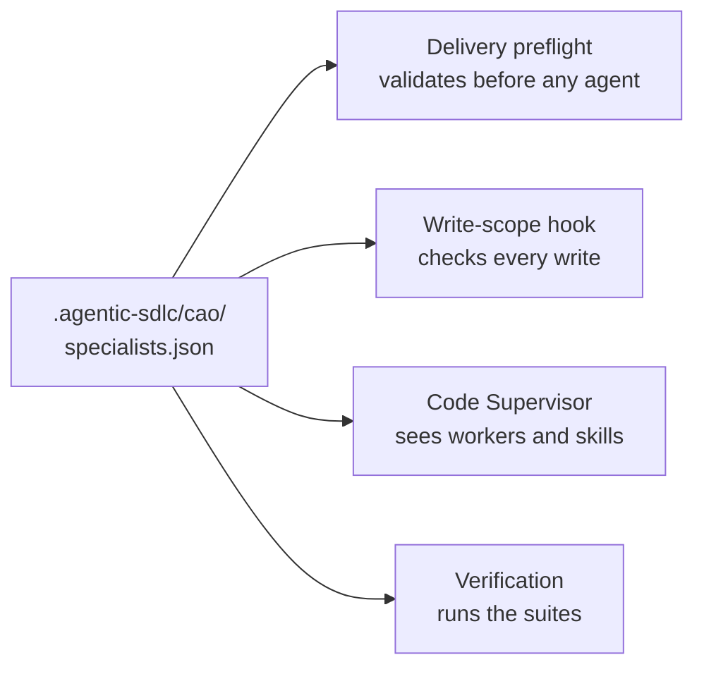

# Delivery workflow (`sdlc_deliver`)

Delivery implements a **human-approved** Development Plan on its own branch, verifies the result with trusted
commands, has an independent agent review the diff, fixes what is safe to fix automatically (at most three
rounds), and stops with a Human Review Brief. It never pushes and never creates a real pull request: the "PR" is
a set of local artifacts, and a human records the final decision.

## At a glance

| | |
|---|---|
| Registered name | `sdlc_deliver` |
| Agents | Code Supervisor (hybrid mode only), Implementer (also the workers and the integrator), PR Reviewer, Remediator |
| Done by Python | Plan checks, branch and commits, verification, review routing, the remediation loop, PR artifacts |
| Requires | A plan approved with `approve_plan.py` (see [Planning](planning.md)) |
| Human gate | Recording the decision on the delivered branch with `record_pr_approval.py` |
| Results | `agentic-sdlc-records/<ticket>/` and the Git branch `sdlc/<ticket>` |
| Write boundary | Implementer and remediator: the configured source roots. Supervisor and PR reviewer: their answer file only. |

## How it works



1. **Check.** Python re-verifies that the plan is approved, that its hash matches, and that the approved baseline
   commit is still an ancestor of the base branch.
2. **Branch.** Work happens on `sdlc/<ticket>`, created from the current tip of the base branch.
3. **Implement.** In hybrid mode a read-only supervisor splits the plan into ordered assignments for registered
   workers, Python dispatches them one after another, and an integration pass reconciles the result; in single mode
   one implementer does everything. See [Specialists and skills](hybrid-delivery.md). Python commits the change.
4. **Verify.** Python runs the registry's commands. One failure gets one repair turn; a second failure ends the run `BLOCKED`.
5. **PR artifacts.** Title, body and diff are written locally. Nothing is pushed.
6. **Review.** A separate read-only agent reviews the diff and classifies the findings. Python applies the routing
   policy, so an agent's own classification is never trusted: high-impact and protected-category findings always go
   to a human, and only findings that meet the auto-fix conditions are remediated.
7. **Remediate.** The remediator fixes exactly the auto-fixable findings, Python verifies again, and the new head is
   reviewed afresh. This repeats at most three times.
8. **Brief.** Python renders the Human Review Brief from the manifest and the reviews.

## Before you run it

1. **Approve a plan.** Run [Planning](planning.md) until it reports `AWAITING_HUMAN_APPROVAL`, read
   `agentic-sdlc-records/<ticket>/development-plan.md`, then record your decision with `approve_plan.py`.
2. **Install the profiles, then the workflow**, in this order (the default mode needs `sdlc_code_supervisor`):

   ```bash
   for profile in code-supervisor implementer pr-reviewer remediator; do
     cao profile validate ".agentic-sdlc/cao/profiles/$profile.md"
     cao install ".agentic-sdlc/cao/profiles/$profile.md"
   done
   bash .agentic-sdlc/cao/workflows/install_deliver.sh "$PWD"
   ```

3. **Have the runtime pieces in the repository you run against:** a running `cao-server`, the write-scope hook
   (`.claude/settings.json` and `.claude/hooks/restrict-write-scope.py`), and the registry
   `.agentic-sdlc/cao/specialists.json`. The hook runs with the `python3` on your `PATH` and uses only the standard library.
4. **Start from a clean tree.** The base branch must exist. In hybrid mode the source roots must have no uncommitted
   changes and the Git index must be empty.
5. **Configure it for your project** if your source is not under `app/` (see [Configuration](#configuration)).

## Inputs

| Input | Required | Meaning |
|---|---|---|
| `ticket_id` | yes | The ticket whose approved plan is implemented. Records live under `agentic-sdlc-records/<ticket_id>/`. |
| `repository_root` | yes | The repository to change. CAO requires an existing directory and refuses system paths such as `/tmp`. |
| `base_branch` | no, default `main` | The delivery branch starts from the current tip of this branch, and the plan's approved baseline must still be its ancestor. |
| `implementation_mode` | no, default `hybrid` | `hybrid`: a supervisor assigns work to registered workers. `single`: one implementer does all the work and verification uses the registry's `application` suite. |

## Run

Use a fresh run ID every time. `--wait --json` prints the workflow's final output, which the default follow mode does not.

```bash
cao workflow run sdlc_deliver --wait --json --run-id deliver-PAY-DEMO-001-1 \
  --input ticket_id=PAY-DEMO-001 --input repository_root="$PWD" --input base_branch=main
```

If the branch `sdlc/<ticket_id>` does not exist it is created from the tip of the base branch; if it exists it is
checked out and continued (delete it with `git branch -D sdlc/<ticket_id>` to start again). **The working tree is
left on the delivery branch**, so return with `git checkout <base_branch>` before doing other work.

## Results

Under `agentic-sdlc-records/<ticket_id>/`:

```text
├── delivery-manifest.json   state, mode, source roots, verification results, review rounds, remediation history, PR head SHA
├── pr-title.txt, pr-body.md, pr-diff.patch      the local "pull request"
├── pr-review-r<N>.json      each independent review round
├── human-review-brief.md    what to read before deciding
├── pr-approval-record.json  after the human decision
└── approval-history/        earlier decisions on superseded heads
```

Detailed evidence (agent answers, dispatch, verification logs) stays under
`.agentic-sdlc/runtime/<ticket_id>/<run-id>/`, which Git ignores. The manifest state moves like this:



## When a run stops early

| Outcome | Meaning | What to do |
|---|---|---|
| `BLOCKED`, `hybrid_implementation_failed: ...` | An implementation step broke its contract. Partial edits stay in the working tree. | Inspect them, reconcile or discard, then run again with a fresh run ID. |
| `BLOCKED`, `verification_failed_after_one_repair_attempt` | Verification still failed after one repair turn. | Read the verification logs; fix the plan, the code or the registry's commands. |
| `BLOCKED`, `verification_failed_after_remediation` | A remediation round broke verification. | Same as above. |
| Run state `failed` | A check stopped the run: the plan is not approved or changed after review, the baseline is no longer an ancestor, the source-root configuration is invalid, the source roots are dirty, or a repair or remediation step changed nothing inside the source roots. | `cao workflow result <run-id> --json` carries the traceback in its `warnings` field. |
| `AWAITING_HUMAN_REVIEW` with `has_developer_required_findings` | The review found items only a human may decide, such as high-impact or protected categories. | Read the brief. |
| `convergence_limit_reached` | Automatic remediation used all three rounds and auto-fixable findings remain. | Read the brief; decide or fix by hand. |

A plan that names files outside the configured source roots cannot be implemented. The agents are told to report
those tasks as deviations instead of writing them, and the hook denies the write anyway.

## Human decisions

When the state is `AWAITING_HUMAN_REVIEW`, review the branch and the brief, then record your decision:

```bash
python3 .agentic-sdlc/scripts/record_pr_approval.py --repository-root "$PWD" --ticket-id PAY-DEMO-001 \
  --decision APPROVED --approved-by "<your name>" --reference "<PR link or note>"
```

It refuses unless the state is `AWAITING_HUMAN_REVIEW` and the delivery branch is still at the reviewed head commit
(if anyone committed since, run Delivery again). A decision on an exact head is immutable; an earlier decision on a
different head is archived under `approval-history/`. The state becomes `HUMAN_APPROVED` or `REJECTED`. Merging, or
opening a real pull request, is outside the workflow.

## Configuration

Delivery is configured by one trusted file, `.agentic-sdlc/cao/specialists.json`, plus two run inputs
(`base_branch` and `implementation_mode`).



| What | Where | Default |
|---|---|---|
| Where generated source is written, committed and diffed | `source_roots` | `["app"]` |
| Which profiles may write there | `write_profiles` | implementer and remediator, all roots |
| Commands that verify a change | `verification` | the sample app's `app` commands |
| Workers, skills and their suites | `workers`, `skills` | one `developer` worker |
| Implementation mode | input `implementation_mode` | `hybrid` |
| Base branch | input `base_branch` | `main` |

The file is read from the repository when a run starts, so edits take effect on the next run. Agents cannot edit it.
An invalid file stops Delivery before any agent runs, and the hook grants nothing while it is invalid; it never
falls back to `app/`. If the file or the keys are absent the defaults apply.

### Registry reference

```json
{
  "version": 1,
  "source_roots": ["app"],
  "write_profiles": {"sdlc_implementer": null, "sdlc_remediator": null},
  "workers": {
    "developer": {
      "profile": "sdlc_implementer",
      "description": "When the supervisor should choose this worker.",
      "skills": ["sdlc-angularjs-ui"],
      "verification": ["application"]
    }
  },
  "skills": {
    "sdlc-angularjs-ui": {
      "path": "skills/sdlc-angularjs-ui/SKILL.md",
      "description": "When the supervisor should require this skill.",
      "verification": ["angularjs"]
    }
  },
  "verification": {
    "application": [["python3", "-m", "compileall", "-q", "app"],
                    ["python3", "-m", "unittest", "discover", "-t", "app", "-s", "app/tests", "-v"]],
    "angularjs": [["npm", "--prefix", "app/ui", "run", "verify"]]
  }
}
```

| Key | Required | Rules |
|---|---|---|
| `version` | yes | Must be `1`. |
| `source_roots` | no, default `["app"]` | See [Source roots](#source-roots). |
| `write_profiles` | no, default implementer and remediator | Which agent profiles may write under the roots. |
| `workers` | yes, not empty | Each worker needs `profile` (an agent profile listed in `write_profiles`), `description` (the supervisor uses it to route work), `skills` (registered skill names; may be empty) and `verification` (a non-empty list of registered suite names). |
| `skills` | yes, not empty | Each skill needs `path` (a file below `.agentic-sdlc/cao`, normally `skills/<name>/SKILL.md`), `description`, and `verification` (a non-empty list of suites that run whenever the skill is selected). |
| `verification` | yes, not empty | Suite name to a non-empty list of commands. A command is a non-empty list of non-empty strings: the program and its arguments, with no shell. |

Each verification pass runs every selected command once from the repository root, with a 300-second timeout,
removing duplicates across suites. A missing executable or a timeout is a failure. In hybrid mode the commands are
the union of the selected workers' and skills' suites; in single mode they are the `application` suite. Changes to
profiles or workflow code, unlike registry and skill edits, need a reinstall.

### Source roots

Generated source is written, committed, verified and diffed under the **source roots**. To point the workflows at
a multi-module project:

```json
{
  "version": 1,
  "source_roots": ["billing/src", "billing/test", "shared/lib"],
  "write_profiles": {"sdlc_implementer": null, "sdlc_remediator": null},
  "verification": {"application": [["mvn", "-q", "-pl", "billing", "verify"]]},
  "workers": {...}, "skills": {...}
}
```

- **`source_roots`**: 1 to 16 relative directories. A root that does not exist yet is fine, because a worker may
  create a new module. Not allowed: absolute paths, `..`, `.`, trailing or doubled slashes, glob characters, `:`,
  and the SDLC's own folders (`.git`, `.claude`, `.agentic-sdlc`, `agentic-sdlc-records`, `agentic-sdlc-docs`,
  `agentic-sdlc-local-inputs`). A root that is a symlink leaving the repository, or pointing into one of those
  folders, is refused.
- **`write_profiles`**: `null` gives a profile every source root; a list limits it to those directories, each equal
  to or inside a source root, for example `"sdlc_java_persistence": ["billing/src"]`. The supervisor, the PR reviewer
  and the planning and source-review profiles can never be listed.
- **`verification`** is not derived from the roots. Point it at your project's own build and test commands.

The delivery manifest records the roots each run used. A plan that names files outside the roots cannot be
implemented, so check the plan's task list against the roots before delivering.

## Safety boundaries

- The write-scope hook confines every agent, and the roots come from the trusted registry; see
  [Agent answers and write scope](../reference/write-scope-hook.md). The supervisor and the reviewer can never write source.
- Verification commands are trusted configuration that Python runs without a shell. Treat a change to them as an
  executable-code change.
- The implementer never runs tests, builds or Git; Python does, so the evidence is not an agent's claim.
- The review is independent and read-only, and its routing is recomputed by Python.
- Remediation is bounded to three rounds and always followed by verification and a fresh review.
- Approval is a human act, bound to the plan's SHA-256 and to the exact reviewed head commit.

## Tests

`tests/test_deliver.py`, `tests/test_hybrid.py`, `tests/test_source_config.py`, `tests/test_restrict_write_scope.py`,
`tests/test_record_pr_approval.py` and the end-to-end flows in `tests/test_workflow_integration.py`. See
[build and install](../build-and-install.md#tests) for how to run them.

## See also

[Specialists and skills](hybrid-delivery.md) · [Planning](planning.md) · [Agent profiles](../reference/agent-profiles.md) ·
[Delivery contract](../../.agentic-sdlc/contracts/delivery-workflow.md) ·
[PR review policy](../../.agentic-sdlc/policies/pr-review.md)
