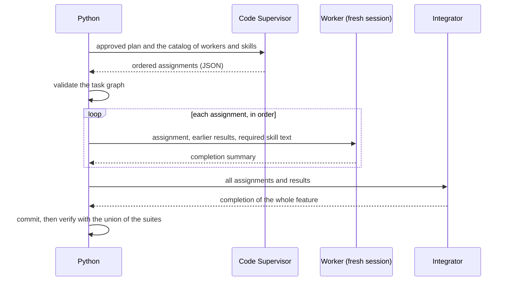
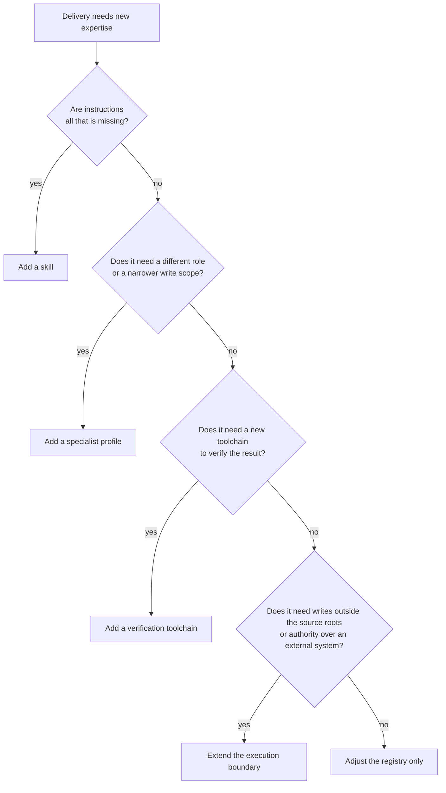

# Delivery: specialists and skills

In its default hybrid mode, [Delivery](delivery.md) does not have one agent implement the whole plan. A read-only
supervisor splits the approved plan into assignments, Python validates them and dispatches registered **workers**
one after another, and a final implementer integrates the result. This guide explains how that works and how to
extend it with skills, specialist profiles, new verification toolchains, and new authority. Running, inputs,
results and approval are in the [Delivery guide](delivery.md).

## At a glance

| Concept | What it is | Where it is defined |
|---|---|---|
| Supervisor | A read-only agent that turns the approved plan into ordered assignments. It cannot write source. | Profile `code-supervisor` |
| Worker | A registry entry naming an agent profile, the skills it may use and its verification suites. | `workers` in `.agentic-sdlc/cao/specialists.json` |
| Skill | Instructions injected into a worker's prompt, plus verification suites that become mandatory when it is selected. | `.agentic-sdlc/cao/skills/<name>/SKILL.md` and `skills` in the registry |
| Verification suite | A named list of commands Python runs after each change. | `verification` in the registry |
| Limits | 1 to 16 assignments; workers run one at a time in one checkout. | Enforced by Python |

## How it works



This is model-directed allocation with deterministic execution, not delegation between agents. No agent can
assign, hand off, run a shell or use Git.

- **Validation.** Python accepts a task graph only if every task has a unique ID, a registered worker, registered
  skills that this worker may use, instructions and a plan reference, and dependencies that name earlier tasks;
  there must be 1 to 16 tasks. An invalid graph stops the run before any worker starts.
- **Sequential.** Each worker starts fresh, but they run one after another in one checkout. That avoids concurrent
  writers and merge races. Parallel dispatch in isolated worktrees is not supported.
- **Judgment stays checked.** Task scope and plan coverage are model judgments. The integration pass and the
  independent review check them again; the validator does not prove that the assignments equal the plan.
- **Ownership.** A worker's file ownership is an instruction. The hard boundary is the write-scope hook and the
  configured [source roots](delivery.md#source-roots).

## Results

Each run keeps the registry, the validated dispatch, every worker's result and the raw agent answers under
`.agentic-sdlc/runtime/<ticket>/<run>/implementation/agent-output/`. The full text of each required skill and its
SHA-256 are included in the worker's prompt and saved in `required-skills.md`. Selected skills also reach the
integration pass, the bounded verification-repair turn and eligible remediation.

Verification is the deduplicated union of the workers' and the selected skills' suites, and it is repeated after
repairs and remediation. The evidence logs record each command and its exit status. A missing executable or a
timeout counts as a failure, never as success.

## When it stops early

An implementation step that breaks its contract, or a graph that fails validation, blocks Delivery. Partial edits
stay in the working tree for inspection and nothing is committed. Inspect or discard them, then run again with a
fresh run ID. The other stop reasons are in the [Delivery guide](delivery.md#when-a-run-stops-early).

## Choosing what to add



Skills are the lightest option and usually enough, because ordinary source work can share one worker's
permissions. A distinct specialist profile is justified when recurring tasks need a different role, a lot of
focused context or a narrower write scope. The two combine.

## Add a skill

1. Choose a precise lowercase hyphenated name and create `.agentic-sdlc/cao/skills/<name>/SKILL.md` with matching
   frontmatter:

   ```markdown
   ---
   name: project-java-persistence
   description: Implement Java persistence changes using this project's transaction and mapping conventions.
   ---

   Inspect existing transaction boundaries and mappings before editing.
   Document project-specific decisions, failure cases and relevant test expectations here.
   ```

2. Write guidance that changes implementation decisions: supported versions, conventions, interface assumptions
   and characteristic failure modes. Avoid generic tutorials, and never grant scope or permissions. Keep the skill
   self-contained: the runner injects only `SKILL.md`, so tell the worker explicitly when and where to read any
   other file.
3. Register it under `skills` with a path relative to `.agentic-sdlc/cao`, a routing description, and existing
   verification suite names:

   ```json
   "project-java-persistence": {
     "path": "skills/project-java-persistence/SKILL.md",
     "description": "Java entity mappings and transaction boundaries; not general UI work.",
     "verification": ["java"]
   }
   ```

4. Add the name to the `skills` list of each eligible worker. The supervisor sees that catalog; Python rejects
   unregistered selections and injects the required text into the assigned worker's prompt. No CAO MCP tool is needed.
5. Test a representative task, an unrelated task that must not select the skill, and a task that combines two
   skills. Inspect the actual code and test evidence, not only the skill selection.
6. Optionally install it for other CAO agents with `cao skills add .agentic-sdlc/cao/skills/<name>` (`--force`
   updates). That native mechanism is separate from this workflow's injection, and the repository copy stays
   authoritative. Do not add a whole orchestration tool bundle to these restricted workers.

Registry and skill edits are read on the next run. Keep skill changes in Git.

The bundled `sdlc-angularjs-ui` and `sdlc-spark-workflows` skills are examples. Their registered verification
commands assume an `app/ui` project with a non-interactive npm `verify` script and an `app/spark/tests/verify.py`
running on synthetic local data, neither of which the sample application contains. Adapt the commands to your
project before assigning those skills; missing tooling fails verification.

## Add a specialist profile

For a distinct role, for example a Java persistence specialist whose files stay inside the source roots:

1. Copy the implementer profile into a new file and give it a unique `name` such as `sdlc_java_persistence`.
   Say when it should own a task. Keep the answer JSON, the assigned-scope behaviour, the ban on shell, Git and
   delegation, and the ban on weakening tests.
2. Register a worker:

   ```json
   "java-persistence": {
     "profile": "sdlc_java_persistence",
     "description": "Own approved Java persistence changes; use developer for unrelated UI work.",
     "skills": [],
     "verification": ["java"]
   }
   ```

   The suite `java` must already exist in `verification`; if it does not, add a toolchain (below). Do not
   substitute Python checks for Java validation.
3. List the profile in `write_profiles`: `null` for every source root, or a list of directories inside the roots
   to limit it, for example `"sdlc_java_persistence": ["billing/src"]`. No hook edit is needed. The worker entry
   does not grant write access by itself, and the registry refuses to load if a worker's profile is not listed.
4. Add hook tests (see `ConfigurableSourceRootsHookTest` in `tests/test_restrict_write_scope.py`) showing that the
   profile can write its roots but not profiles, the registry, guardrails or records, and test supervisor routing
   with a representative task and an overlapping generalist task.
5. Validate and install the profile (`cao profile validate <file>`, `cao install <file>`), reinstall the delivery
   workflow if runner code changed, and run a fixture. Inspect the dispatch, the worker evidence, the verification
   and the final diff. Installed profile edits need a reinstall; the supervisor needs no prompt change because it
   receives the registry.

## Add a verification toolchain

For example, Spark verification in an isolated local Spark runtime:

1. Add a distinct worker profile only if the role differs (above); a general developer plus the Spark skill may
   be enough when only the verifier needs the new runtime.
2. Provision pinned, compatible dependencies in the environment that runs the workflow (Java, Spark, project
   dependencies). Workers do not install them.
3. Provide an application-owned, non-interactive test entry point that uses synthetic data, a local or isolated
   runtime, and returns non-zero on failure.
4. Add a named suite to `verification` as a list of argument lists:

   ```json
   "spark": [["spark-submit", "--master", "local[2]", "app/spark/tests/verify.py"]]
   ```

   Commands run from the repository root with a 300-second timeout each. Pipes, substitutions and redirections are
   not interpreted. If the environment needs preparation, use a reviewed executable wrapper. Never take commands
   from model output.
5. Reference the suite from the worker's `verification`, or from the skill's when only that skill needs the runtime.
   A suite named by a selected skill is mandatory.
6. Test passing, assertion-failing, missing-runtime and timeout cases; confirm the same suites run after repair and
   remediation and that the Human Review Brief shows the evidence. Validate the toolchain in its intended environment.

Changing a command does not provision the environment. If the toolchain needs access to an external system, extend
the execution boundary (below).

## Extend the execution boundary

Some capabilities cannot be a registry entry: applying a database migration (rather than writing migration source)
needs authority over a named environment. Delivery has no live migration executor, so this is code and operational
design, not configuration.

1. Separate the capability. Writing migrations can stay inside the source roots; applying them cannot.
2. Define the exact resources, credentials, permitted operations, approval evidence, timeouts, retries and recovery.
   Never place credentials in skills, prompts or registry command arguments.
3. Implement a trusted executor with scoped credentials that checks permissions and approvals itself. Keep external
   mutations outside model tools. A profile's prose and a skill catalog are not access controls.
4. Add an explicit workflow stage and result contract for the executor. Bind any approval to the target, the
   artifact and the environment, and stop retries from repeating irreversible work. Keep the plan and PR gates.
5. Adding or moving source roots is configuration. A capability that needs writes outside the roots, or a new kind
   of authority, must change the hook deliberately, with denial, identity-failure and path-escape tests. A registry
   entry alone must never widen permissions. Do not grant a whole tool bundle to obtain one capability.
6. Exercise the executor against an isolated disposable environment: unauthorized targets, expired or mismatched
   approval, partial failure and recovery.
7. Register and install the profile only after those controls exist, document the operational prerequisites and
   enable the stage through reviewed configuration.

The hybrid mode never silently authorizes database, cloud or cluster changes, and local verification commands must
also be reviewed for external effects.

## Safety boundaries

- Registry commands are trusted maintainer configuration, run by Python without a shell. Treat a change to them as
  an executable-code change.
- Agents cannot edit the registry or the profiles: both are under a folder the hook protects.
- A skill guides implementation; it grants no authority. Only `write_profiles` and the hook decide who may write where.
- The supervisor never modifies source or runs commands, and the integrator writes only under the source roots.

See [Agent answers and write scope](../reference/write-scope-hook.md) for the enforcement design.

## Tests

`tests/test_hybrid.py` (registry, task graph, dispatch, verification union), `tests/test_source_config.py` (source
roots and write profiles), `tests/test_restrict_write_scope.py` (the boundary) and the hybrid flows in
`tests/test_workflow_integration.py`. See [build and install](../build-and-install.md#tests) for how to run them.

## See also

[Delivery](delivery.md) · [Agent profiles](../reference/agent-profiles.md) ·
[CAO skills](https://github.com/awslabs/cli-agent-orchestrator/blob/main/docs/skills.md) ·
[CAO profiles](https://awslabs.github.io/cli-agent-orchestrator/docs/features/profiles/) ·
[AngularJS components](https://docs.angularjs.org/guide/component) ·
[Spark Structured Streaming](https://spark.apache.org/docs/latest/structured-streaming-programming-guide.html)
