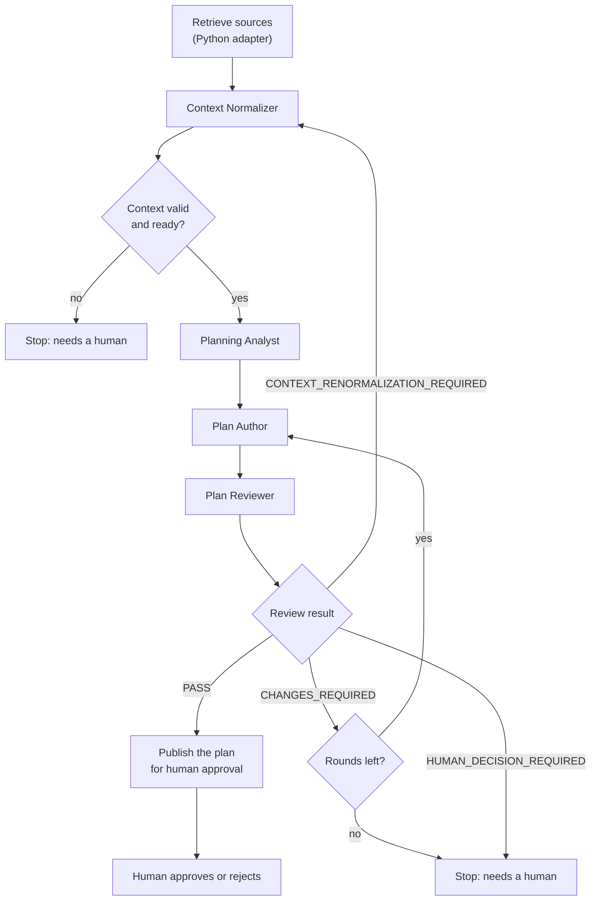
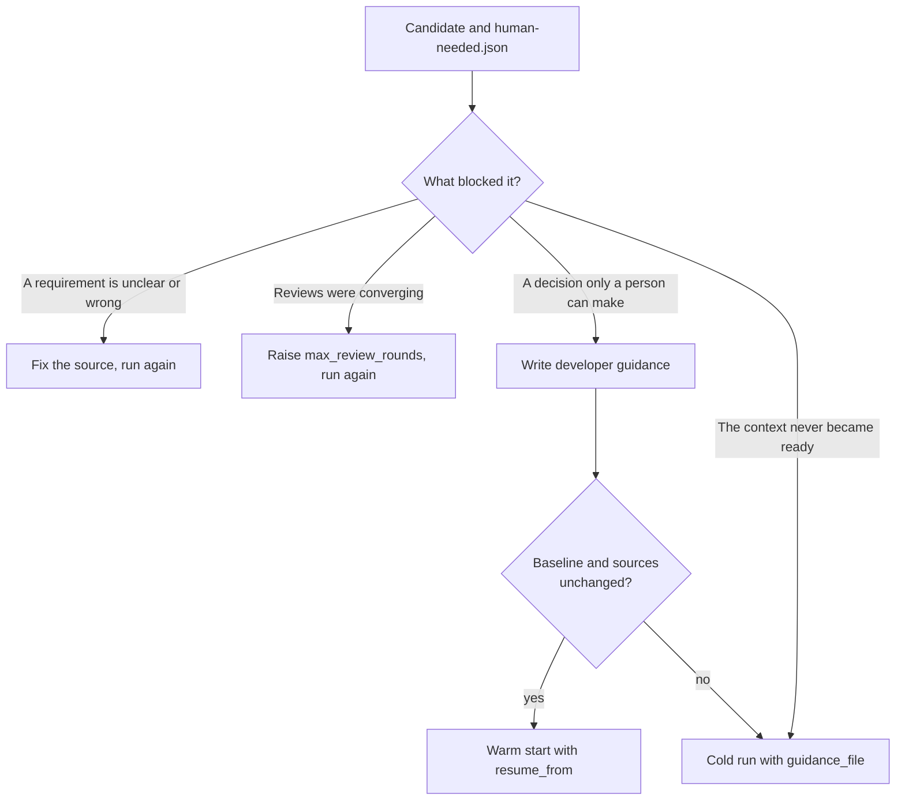

# Planning workflow (`sdlc_dev_plan`)

Planning turns a Jira ticket and its Confluence pages into a reviewed Development Plan that a human can
approve. It retrieves the sources, normalizes them into a validated Planning Context, analyses the repository,
authors a plan, and has an independent reviewer challenge it. It stops at a plan awaiting human approval.
It never approves a plan and never changes source code.

## At a glance

| | |
|---|---|
| Registered name | `sdlc_dev_plan` |
| Agents | Context Normalizer, Planning Analyst, Plan Author, Plan Reviewer (four profiles, all limited to writing their own answer file) |
| Done by Python | Source retrieval, validation, review-loop control, publication |
| Human gate | Approving the reviewed plan with `approve_plan.py` |
| Results | `agentic-sdlc-records/<ticket>/` |
| Next workflow | [Delivery](delivery.md), which accepts only an approved plan |

## How it works



1. **Retrieve.** A deterministic adapter fetches the ticket and pages without rewriting them.
2. **Normalize.** The Context Normalizer turns the sources into a Planning Context with provenance for every claim.
3. **Validate.** Python checks the context against its schema and readiness rules. Blocking open questions or a
   missing required source stop the run.
4. **Analyse.** The Planning Analyst maps the requirements onto the current repository.
5. **Author.** The Plan Author writes the Development Plan from the template: tasks, dependencies, verification.
6. **Review.** The Plan Reviewer checks the plan against the context, the raw sources and the repository. Python,
   not the model, decides what happens next: publish on `PASS`, send the plan back for revision on
   `CHANGES_REQUIRED` (up to `max_review_rounds`), re-normalize the context, or stop for a human.
7. **Publish.** Only a plan whose review returned `PASS` is published.

From the second review onward the reviewer receives the earlier reviews and must account, in `prior_findings`,
for every blocking finding of the most recent one, using refs like `r2:PLAN-003` (finding ids repeat across
reviews). Python checks that each ref appears exactly once, that none is unknown, and that `PASS` is refused
while any prior finding is `UNRESOLVED`. A response that fails the check gets one repair turn. The reviewer stays
independent: it re-verifies each finding and may raise new ones.

## Before you run it

1. Start `cao-server`.
2. Install the four planning profiles (`context-normalizer`, `planning-analyst`, `plan-author`, `plan-reviewer`)
   with the loop in the [profile guide](../reference/agent-profiles.md#install-planning-profiles).
3. Install the workflow from the repository root:

   ```bash
   bash .agentic-sdlc/cao/workflows/install.sh "$PWD"
   ```

   It registers as `sdlc_dev_plan`. CAO's registry is shared by every project on the machine, so all workflow and
   profile names carry the `sdlc_` prefix. See [build and install](../build-and-install.md) for what the installer does.

## Inputs

| Input | Required | Meaning |
|---|---|---|
| `ticket_id` | yes | The ticket identifier, for example `PAY-DEMO-001`. Results go under `agentic-sdlc-records/<ticket_id>/`. |
| `repository_root` | yes | Absolute path of the repository to analyse. |
| `source_dir` | yes | Directory holding the source manifest; its shape depends on `source_adapter`. |
| `baseline_sha` | yes | The commit the plan is written against. It is an explicit input so a replay cannot shift the baseline. |
| `base_branch` | no, default `main` | The branch the plan will later be delivered against. |
| `source_adapter` | no, default `local_fixture` | `local_fixture` or `jira_confluence_live`; see [Source adapters](#source-adapters). |
| `max_review_rounds` | no, default 3 | 1 to 10. A cap, not a target: the loop stops at the first `PASS`. |
| `guidance_file` | no | Developer guidance for the agents; see [Developer guidance](#developer-guidance). |
| `resume_from` | no | A candidate directory to continue from; see [Warm start](#warm-start). |

## Run

Use a fresh run ID every time; an ID cannot be reused. `--wait --json` prints the workflow's final output,
including the blockers of a run that needs a human. The default follow mode prints only the run ID and state.

```bash
BASELINE_SHA=$(git rev-parse --verify HEAD)
cao workflow run sdlc_dev_plan --wait --json --run-id plan-PAY-DEMO-001-1 \
  --input ticket_id=PAY-DEMO-001 \
  --input repository_root="$PWD" \
  --input source_dir="$PWD/agentic-sdlc-local-inputs/PAY-DEMO-001" \
  --input baseline_sha="$BASELINE_SHA" \
  --input base_branch=main \
  --input max_review_rounds=3
```

Follow or inspect a run with `cao workflow status <run-id>`, `cao workflow events <run-id> --follow` and
`cao workflow result <run-id>`; stop it with `cao workflow cancel <run-id>`.

## Results

A run that converges publishes:

```text
agentic-sdlc-records/<ticket>/
├── development-plan.md
├── plan-review.json          the passing review, bound to the plan's SHA-256
├── execution-manifest.json   baseline, digests, review rounds, guidance and lineage
└── plan-guidance.md          only when guidance_file was used
```

Its outcome is `AWAITING_HUMAN_APPROVAL`. Detailed per-step evidence (agent answers, the accepted raw output,
stabilization logs) stays under `.agentic-sdlc/runtime/<ticket>/<run-id>/`, which Git ignores.

## When a run stops early

If the independent review cannot return `PASS`, or the context is not ready, nothing approvable is published.
The run ends `completed` in CAO with the outcome `AWAITING_HUMAN_CLARIFICATION` and leaves a durable,
non-approvable snapshot:

```text
agentic-sdlc-records/<ticket>/candidates/<run-id>/
├── candidate-manifest.json   state NOT_CONVERGED, stop cause, digests of every file
├── human-needed.json         blockers, the blocking findings, next steps
├── candidate-plan.md         the last plan (absent if none was written)
├── reviews/<k>-review-r<N>-c<V>.json   k is the review's position in the history and matches the refs r<k>:<id>
├── planning-context.json, planning-analysis.md, sources.json
└── guidance.md               the guidance used, if any
```

| Stop cause | Meaning |
|---|---|
| `review_convergence_limit_reached` | The reviewer still had blocking findings after `max_review_rounds`. |
| `plan_review_requires_human_decision` | The reviewer found a decision that only a person can make. |
| `renormalized_context_not_ready` | After a re-normalization the context still has blockers. |
| `context_not_ready` | The first context has blockers, for example a required source is unavailable. |

A candidate can never be approved or delivered: `approve_plan.py` and Delivery read only
`agentic-sdlc-records/<ticket>/development-plan.md`. Read `human-needed.json` first, then choose a way forward:



## Human decisions

A human, never an agent, records the decision on the published plan:

```bash
python3 .agentic-sdlc/scripts/approve_plan.py --repository-root "$PWD" --ticket-id PAY-DEMO-001 \
  --decision APPROVED --approved-by "<your name>" --reference "<ticket or review link>"
```

The script refuses if the plan, or the guidance it was built with, changed after review. It records the plan
hash, the baseline and the guidance digest in `plan-approval-record.json`. A decision on an exact plan is
immutable, and `--decision REJECTED` is recorded the same way. Only an approved plan can be delivered.
A new planning run for a ticket whose plan is already approved fails before any agent runs, so an approved plan is
never overwritten. To plan the ticket again, move `agentic-sdlc-records/<ticket>/` out of the way first.

## Configuration

### Source adapters

Retrieval is deterministic Python, never an agent. The `source_adapter` input picks the adapter, and both
produce the same source files and `retrieval.json`, so nothing downstream depends on which one ran.

- **`local_fixture`** (default) copies the files named in `source_dir/context.json`. It needs no network and is
  what the tests and the PAY-DEMO-001 example use.
- **`jira_confluence_live`** reads the same manifest shape but each entry names a remote id and is fetched over HTTP:

```json
{
  "schema_version": "1.0",
  "ticket": { "id": "PAY-DEMO-001", "source_id": "JIRA:PAY-1234", "title": "...", "jira_key": "PAY-1234", "required": true },
  "confluence": [
    { "source_id": "CONF:123456789", "title": "Feature Spec", "page_id": "123456789", "required": true }
  ]
}
```

`ticket.id` is the workflow's internal ticket id; `ticket.jira_key` is the real Jira issue key. A manifest may list
extra Confluence pages that the ticket does not link (an incident write-up, a design note), so a person can curate
context that Jira does not capture.

Credentials are environment variables, never manifest fields, so a manifest can be committed safely:

| Variable | Purpose |
|---|---|
| `JIRA_BASE_URL`, `CONFLUENCE_BASE_URL` | For example `https://your-domain.atlassian.net` |
| `JIRA_API_TOKEN`, `CONFLUENCE_API_TOKEN` | Sent as `Authorization: Bearer ...` |

A missing variable fails the run immediately. An HTTP failure for one source marks that source `UNAVAILABLE`,
which stops the run through the normal required-source check.

Limitations of the live adapter: Jira descriptions and Confluence pages are flattened to plain text, so tables,
panels and inline formatting collapse to the text they carry. The adapter has been tested against a local fake
server, not against a real Atlassian tenant.

### Developer guidance

A re-run alone gives no guarantee of a different result. `guidance_file` lets a developer give the agents
information they lacked, using the [template](../templates/developer-guidance.md):

```bash
cao workflow run sdlc_dev_plan --wait --json --run-id plan-PAY-DEMO-001-2 \
  --input ticket_id=PAY-DEMO-001 --input repository_root="$PWD" \
  --input source_dir="$PWD/agentic-sdlc-local-inputs/PAY-DEMO-001" --input baseline_sha="$BASELINE_SHA" \
  --input guidance_file=agentic-sdlc-records/PAY-DEMO-001/guidance.md
```

- The file must be a non-empty UTF-8 regular file of at most 64 KiB, inside `repository_root` (symlinks that
  leave it are refused) and outside `.agentic-sdlc/runtime/`.
- It reaches the Planning Analyst, Plan Author and Plan Reviewer, not the Context Normalizer, so the normalized
  requirements stay faithful to the sources. Each run works on a frozen copy.
- **Authority.** Guidance may resolve an ambiguity, choose between options the sources allow, narrow the scope or
  constrain the design. It cannot relax a source requirement or the governance policy; the reviewer reports a
  conflict as `HUMAN_DECISION_REQUIRED`, so the source gets corrected. The plan cites each applied item.
- **Trust.** Guidance is trusted because a human wrote it and it lives where no agent can write. Its SHA-256 is
  recorded in the manifest, the exact file is published as `plan-guidance.md`, and `approve_plan.py` checks it,
  so approval covers the guidance (governance invariant 16). A `PASS` review is still required (invariant 17).

### Warm start

A non-converged candidate can be continued instead of starting over:

```bash
cao workflow run sdlc_dev_plan --wait --json --run-id plan-PAY-DEMO-001-3 \
  --input ticket_id=PAY-DEMO-001 --input repository_root="$PWD" \
  --input source_dir="$PWD/agentic-sdlc-local-inputs/PAY-DEMO-001" --input baseline_sha="$BASELINE_SHA" \
  --input resume_from="$PWD/agentic-sdlc-records/PAY-DEMO-001/candidates/<run-id>" \
  --input guidance_file=agentic-sdlc-records/PAY-DEMO-001/guidance.md
```

The run reuses the candidate's context and analysis, starts with a revision round from its last plan and reviews,
and then runs the normal review loop with its own round budget. The reviewer receives the candidate's reviews as
history. The published manifest records the lineage (`resumed_from`) and `total_review_rounds`.

It fails closed, before any agent runs, when:

- `resume_from` is not a `NOT_CONVERGED` candidate of this ticket, or a recorded file is missing, unsafe or changed;
- the stop cause was `renormalized_context_not_ready` or `context_not_ready` (those need a cold run);
- `baseline_sha` differs from the candidate's, or the freshly retrieved sources differ (its analysis would be stale);
- the candidate stopped for a human decision and `guidance_file` is missing or unchanged.

After a round-limit stop no guidance is needed: the run simply continues with a new round budget.

## Safety boundaries

- The four agents may write only their instructed answer file; a hook enforces that independently of the agents.
  See [Agent answers and write scope](../reference/write-scope-hook.md).
- Python owns the control flow. The workflow, not a model, decides whether findings cause a revision,
  a re-normalization or a stop.
- Approval is a separate human act bound to the plan's SHA-256 and the baseline SHA; a modified plan cannot be approved.

## Tests

`tests/test_dev_plan.py` (retrieval, validation, the live adapter against a fake server), `tests/test_planning_nonconvergence.py`,
`tests/test_planning_guidance.py`, `tests/test_planning_reviewer_history.py`, `tests/test_planning_warm_start.py` and the
integration tests in `tests/test_workflow_integration.py`. See [build and install](../build-and-install.md#tests) for how to run them.

## See also

[Delivery](delivery.md) · [Agent profiles](../reference/agent-profiles.md) ·
[Planning contract](../../.agentic-sdlc/contracts/planning-workflow.md) ·
[Developer guidance template](../templates/developer-guidance.md)
