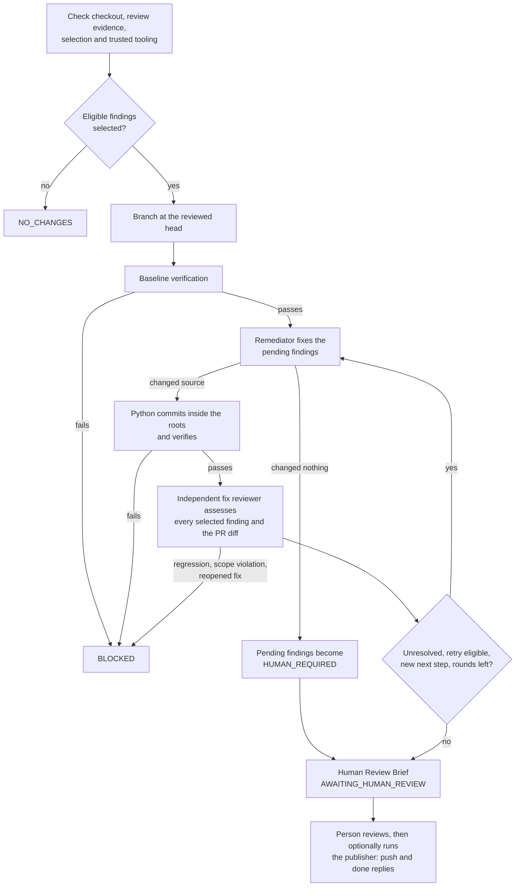
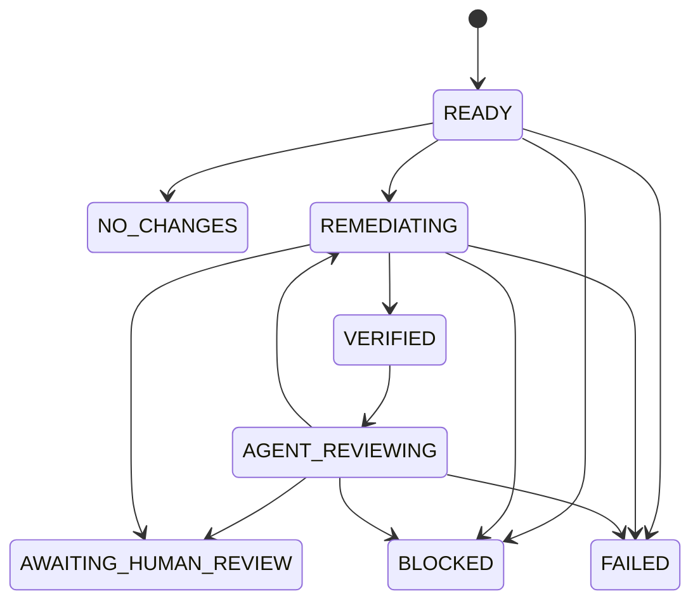

# Source remediation workflow (`source_remediate`)

Source remediation fixes eligible [Source review](source-review.md) findings without a Jira ticket or Development
Plan. It reuses Delivery's remediator, configured write roots, verification runner and execution support. A
separate read-only reviewer checks each attempted fix and the whole resulting PR diff. Source review itself stays
read-only.

It works on a local branch and writes local records. It never pushes, comments, approves or merges on its own: a
person reviews the result, then runs a separate command that can push the verified commit and post "done" replies.

## At a glance

| | |
|---|---|
| Registered name | `source_remediate` |
| Agents | Remediator (`sdlc_remediator`, shared with Delivery) and Source Fix Reviewer (`sdlc_source_fix_reviewer`) |
| Done by Python | Checking the review evidence and selection, the branch, baseline and post-fix verification, scoped commits, evidence digests, the Human Review Brief, publication |
| Requires | A completed Source review run with status `REVIEWED`, and a clean checkout at its reviewed head |
| Human gate | A person reads the brief and decides whether to run the publisher; a person handles every `HUMAN_REQUIRED` finding. Nothing approves, resolves threads on or merges the PR. |
| Results | `agentic-sdlc-records/source-remediation/<review>-<run-id>/` and the local branch `sdlc/source-remediate/<run-id>` |
| Write boundary | Remediator: the source roots `write_profiles` gives `sdlc_remediator`. Fix reviewer: its answer area only. |

## How it works



1. **Check.** Python requires a clean checkout with no untracked files and an empty index, takes a lock on the
   checkout, and loads the Source review directory. The report must be `REVIEWED` under policy `source-review-v1`,
   and its evidence files must be present and unchanged. For a GitHub review, the PR must still be open with the
   reviewed base and head.
2. **Select.** All `AUTO_FIX` findings are selected unless a selection file narrows them. A finding outside the
   remediator's source roots is excluded as `HUMAN_REQUIRED`. Python pins the digests of the review, the selection,
   the configuration and the tooling under `.claude/` and `.agentic-sdlc/`; any change to them during the run blocks it.
3. **Branch and baseline.** Python creates `sdlc/source-remediate/<run-id>` at the reviewed head and runs the
   project's `application` verification suite. A failing baseline stops the run before any fix is attempted.
4. **Fix.** The remediator attempts the pending findings, adding focused tests where needed. Python commits only
   changes inside its source roots and runs verification again. If the remediator changes nothing, its pending
   findings go to the human and the loop ends.
5. **Independent review.** The fix reviewer decides every selected finding at the current candidate, including
   ones fixed in earlier rounds, and checks the whole PR diff for regressions, unrelated edits and weakened tests.
   `FIXED` needs source and verification evidence that the original failure is prevented.
6. **Retry or stop.** An `UNRESOLVED` finding is retried only when it is still eligible and the reviewer gives a new,
   concrete next step. At most three fix rounds run; anything left becomes `HUMAN_REQUIRED`.
7. **Brief.** Python renders the Human Review Brief. Publishing is a separate command
   ([Human decisions](#human-decisions)).

## Before you run it

1. A running `cao-server` and a configured `claude_code` provider.
2. Wait until runs using the shared remediator have finished, then install the two profiles and the workflow. The
   workflow installer checks that both profiles exist and never overwrites the shared profile:

   ```bash
   cao profile validate .agentic-sdlc/cao/profiles/remediator.md
   cao profile validate .agentic-sdlc/cao/profiles/source-fix-reviewer.md
   cao install .agentic-sdlc/cao/profiles/remediator.md
   cao install .agentic-sdlc/cao/profiles/source-fix-reviewer.md
   bash .agentic-sdlc/cao/workflows/install_source_remediate.sh "$PWD"
   ```

3. The target repository needs the delivery governance policy, this workflow's
   [contract](../contracts/source-remediation-workflow.md) and [policy](../policies/source-remediation.md), the
   `.claude` write-scope hook wired on `Write|Edit|NotebookEdit`, and an `application` verification suite in
   `agentic-sdlc-project.json` (see [Configuration](#configuration)).
4. A completed Source review run. Publish that review first if you want done replies later: the publisher can only
   answer comments whose publication was recorded before remediation started.
5. A clean checkout at the exact reviewed head, with the base and merge-base commits available. For a GitHub review,
   `gh` must be authenticated on the server host. Keep other workflows and editors out of the checkout while it runs.

## Inputs

| Input | Required | Meaning |
|---|---|---|
| `repository_root` | yes | The Git root of the repository to fix, checked out at the reviewed head. |
| `review_directory` | yes | The Source review run directory, for example `.agentic-sdlc/runtime/source-review/<run-id>`. |
| `selection_file` | no | A JSON file that narrows the findings to attempt (format below). Without it, every eligible finding is selected. |

The selection file lists finding IDs from the report:

```json
{"selected":["SR-0123456789abcdef"],"excluded":[{"id":"SR-fedcba9876543210","reason":"Human will handle this"}]}
```

Unknown, duplicate, conflicting and ineligible selections are refused: a selection can narrow the eligible work but
never promote a `HUMAN_REQUIRED` finding. Do not pass the Markdown comments as input; the structured report, its
mapping and the validator's evidence establish identity and eligibility. A draft's `publish=no` affects publication
only; use the selection file to exclude a fix.

## Run

Use a fresh run ID every time:

```bash
cao workflow run source_remediate --wait --json --run-id fix-001 \
  --input repository_root="$PWD" \
  --input review_directory="$PWD/.agentic-sdlc/runtime/source-review/review-pr42-1"
```

**The working tree is left on `sdlc/source-remediate/<run-id>`**, so return to your branch before other work.
Commit or move earlier untracked records before starting another run; never delete evidence just to make the
checkout clean.

## Results

The workflow output names the records directory. For PR #42 and run `fix-001` it is
`agentic-sdlc-records/source-remediation/pr-42-fix-001/`; a local fixture review uses `local-<sha12>-<run-id>/`.

```text
agentic-sdlc-records/source-remediation/<review>-<run-id>/
├── human-review-brief.md       fixes, escalations, original human findings and coverage gaps
├── remediation-manifest.json   review identity, state, candidate commit, history, publication_safe, evidence digests
├── authorization.json          the review digest, snapshot and selected IDs that authorize the run
├── selected-findings.json      the selected findings and the exclusions with reasons
├── source-review.json, source-mapping.json, source-publication.json   frozen review evidence
├── remediation-r<N>.json       each round's remediator summary
├── verify-baseline.json, verify-r<N>.json   verification at the reviewed head and after each round
├── current-pr-diff.json        the whole PR diff the fix reviewer assessed
├── fix-review-r<N>.json        the independent decision for every selected finding
├── remediation-diff.patch      the cumulative fix changes
└── publication.json            written later by the publisher: pushed state and replies
```

Detailed logs and agent answers stay under `.agentic-sdlc/runtime/source-remediation/<run-id>/`, which Git ignores.
If the run stops before its records directory exists, the manifest and brief are written there instead. The
manifest state moves like this:



`AWAITING_HUMAN_REVIEW` does not mean every finding was fixed: read each resolution and `publication_safe`. `FIXED`
means independently verified locally; it does not mean pushed, commented, approved or merged.

## When a run stops early

| Outcome | Meaning | What to do |
|---|---|---|
| `NO_CHANGES` | No eligible finding was selected (none in `AUTO_FIX`, all excluded, or all outside the remediator's roots). | Handle the findings by hand, or adjust the selection. |
| `BLOCKED` before branching | The checkout was dirty, the review is not `REVIEWED` or its evidence changed, the PR moved or closed, the selection is invalid, a profile, the hook or the `application` suite is missing, the records directory already exists, or another run holds the checkout lock. | Fix the cause; a moved PR needs a new Source review. Start a new run with a fresh run ID. |
| `BLOCKED`, baseline verification failed | The reviewed head already fails verification, so no fix was attempted. | Fix the build or the suite, then review and remediate again. |
| `BLOCKED` after a fix round | Verification failed after a fix, the fix reviewer found a regression, scope violation or unassessable change, a fix from an earlier round reopened, the remediator claimed a finding it was not given, or protected tooling or evidence changed. | The branch and evidence are kept. Read the brief and `fix-review-r<N>.json`; finish by hand or discard the branch. |
| `FAILED` | An unexpected error; the CAO run fails too. | Read `failure.json` in the runtime folder and `cao workflow result <run-id> --json`. |
| Run refused at once (run state `failed`, no manifest) | The run ID is invalid or already used, or `repository_root` is not the Git root. | Use a fresh run ID and the repository root. |
| A stale `source-remediation.checkout.lock` | A hard crash left the lock under `.agentic-sdlc/runtime/`. | Confirm the workflow and its terminals have stopped, inspect the branch and evidence, then remove only that lock. |

Never reuse a run ID or delete source changes to recover; each run keeps its own records.

## Human decisions

### Review the local fixes

Read `human-review-brief.md`, then `remediation-diff.patch` and the latest `fix-review-r<N>.json`. Each selected
finding ends `FIXED`, `UNRESOLVED` or `HUMAN_REQUIRED`; the original `HUMAN_REQUIRED` findings from the review are
listed too and remain your work. Only a run in `AWAITING_HUMAN_REVIEW` with `publication_safe` true can be published.

### Publish

```bash
python3 .agentic-sdlc/scripts/publish_source_remediation.py \
  agentic-sdlc-records/source-remediation/pr-42-fix-001
```

| Command | Effect |
|---|---|
| no flag | Preview: shows the exact reply bodies and the push destination; writes nothing to GitHub. |
| `--publish` | Posts the done replies. The verified commit must already be the PR head (you pushed it yourself). |
| `--publish --push` | Fast-forwards the existing PR branch to the verified commit first, then posts the replies. `--push` alone is invalid. |

Before writing anything the publisher re-checks every evidence digest, that the checkout is still the verified
candidate with no changes, that the PR is open with the reviewed base, and that the remote head is already the
candidate or, with `--push`, still the reviewed head that the candidate fast-forwards. Fork destinations come from the PR's actual head repository and branch, not
from `origin`. A missing branch or access, or a moved remote tip, stops publication. There is no force-push, PR
creation, approval, merge or thread resolution.

Only independently verified fixes at the current PR head get a done reply. A stable marker in comments published by
Source review identifies the original thread. Findings published by an older Source review as general comments get
one PR conversation summary; omitted or unpublished findings get no notification.

Push and comments are not atomic. A failure after pushing keeps the commit and records the outstanding replies in
`publication.json`; run the same command again, and the markers already on GitHub prevent duplicate replies, also
after a lost response. A surviving `publication.lock` means another invocation is running or crashed: check the
process and the remote state before removing it. If the PR moves again, run a new review; do not rewrite old evidence.

## Configuration

Source remediation reads the same trusted files as Delivery; there is no separate configuration.

- **Write roots:** the roots that `write_profiles` gives `sdlc_remediator` in `agentic-sdlc-project.json` (see
  [source roots](delivery.md#source-roots)). Findings outside them are excluded as `HUMAN_REQUIRED`.
- **Verification:** the `application` suite from the same file, run from the repository root without a shell. Without
  a project file, the legacy keys in `.agentic-sdlc/cao/specialists.json` apply, as in Delivery.
- **Contract and policy:** [contract](../contracts/source-remediation-workflow.md) and
  [policy](../policies/source-remediation.md); both are given to the agents and pinned for the run.

## Safety boundaries

- The write-scope hook confines the remediator to its source roots and the fix reviewer to its answer area; the
  `sdlc_source_` profiles are always read-only. See [Agent answers and write scope](../reference/write-scope-hook.md).
- Python, not an agent, commits, and only paths inside the remediator's roots; it checks that exactly the validated
  paths are staged. The tooling under `.claude/` and `.agentic-sdlc/` and the run's evidence are pinned by digest and
  re-checked around every agent step.
- Authorization comes from the validated review evidence and the optional selection, never from comment text. The
  agents never execute a command suggested in a comment; Python runs only the trusted `application` suite.
- Every selected finding gets an explicit independent decision at the current candidate; a fixer's claim or a missing
  finding is not evidence. New findings always go to a human.
- The publisher acts only on a verified, unchanged candidate, never force-pushes, and posts only to an allow-listed set
  of GitHub endpoints.
- Verification runs project code and tests on the host. Use only operator-trusted repositories and configuration;
  this is not an operating-system isolation boundary. The broad runtime-answer write permission remains a separate
  [hardening](../../hardening-plan.md) task.

## Tests

`tests/test_source_remediation.py` uses real temporary Git repositories, commits, source exports and verification
commands, with agent and GitHub responses simulated. It covers evidence and selection checks, out-of-root and dirty
checkouts, the three-round limit and escalation, independent per-finding decisions, the publisher's remote checks,
retries and tamper detection. The hook's read-only rule for `sdlc_source_` profiles is tested in
`tests/test_restrict_write_scope.py`. See [build and install](../build-and-install.md#tests) for how to run them, and
the [verification record](../verification/source-remediation.md) for the live checks and their limits.

## See also

[Source review](source-review.md) · [Delivery](delivery.md) · [Contract](../contracts/source-remediation-workflow.md) ·
[Policy](../policies/source-remediation.md) · [Agent profiles](../reference/agent-profiles.md)
