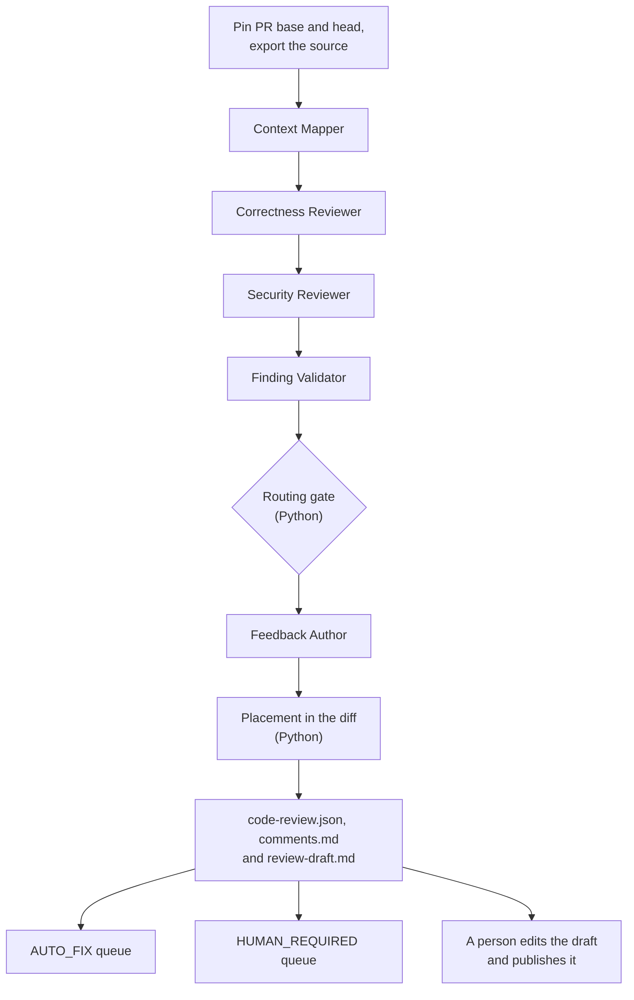
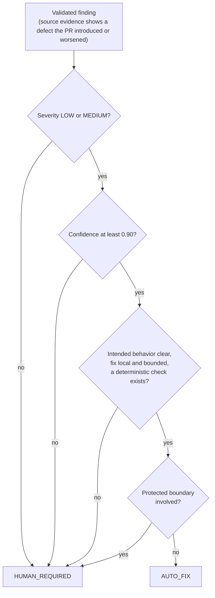
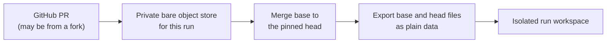
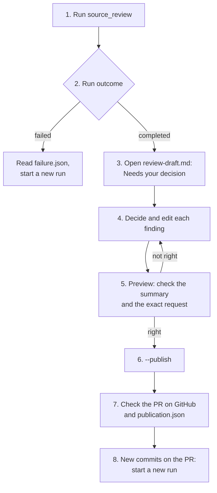
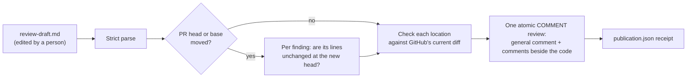
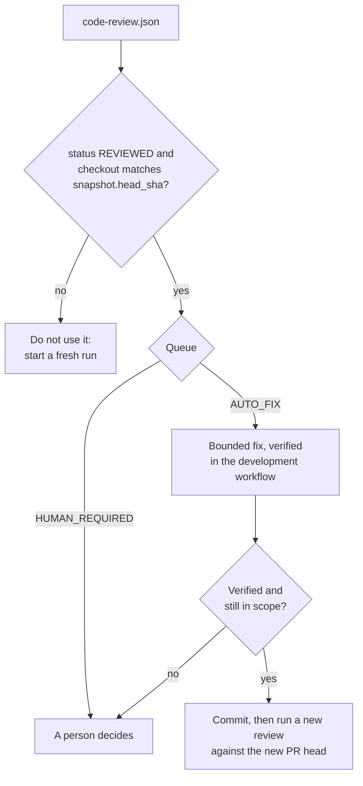

# Source review workflow (`source_review`)

Source review reviews an existing GitHub pull request and produces actionable feedback for a development agent
and a human reviewer. It is independent of Planning and Delivery: no Jira ticket, approved plan, CI result or
delivery manifest is needed.

It reads source. It does not fix code, run tests, assess requirements compliance or deployment readiness,
approve a pull request or merge it. It writes local artifacts, including an editable publication draft. A
person reviews and edits the draft, then runs a separate command that posts it as one non-blocking `COMMENT`
review, with a comment beside the code for each finding it can place.

## At a glance

| | |
|---|---|
| Registered name | `source_review` |
| Agents | Context Mapper, Correctness Reviewer, Security Reviewer, Finding Validator, Feedback Author (five profiles) |
| Done by Python | Pinning the PR, exporting the source, the routing gate, placing findings in the diff, rendering the artifacts, publication |
| Requires | A GitHub PR URL, or a local committed repository in fixture mode |
| Human gate | A person edits `review-draft.md` and runs the publish command; a person decides the `HUMAN_REQUIRED` findings. Nothing approves, requests changes on or merges the PR. |
| Results | `.agentic-sdlc/runtime/source-review/<run-id>/` |
| Write boundary | Each agent may write only the answer area of the run's isolated workspace, through a hook generated for that workspace |

## How it works



1. **Context Mapper.** Accounts for every changed file, separates source and test files from out-of-scope material,
   and identifies callers and sensitive boundaries.
2. **Correctness Reviewer.** Traces changed behavior, edge cases, compatibility and test-source defects. A finding
   needs a concrete, reachable failure scenario.
3. **Security Reviewer.** Independently examines authorization, sensitive data, transactions, concurrency and
   resource lifetime.
4. **Finding Validator.** Re-reads the source, checks guards and base and head behavior, rejects speculation,
   merges findings that share a root cause and reassesses fix eligibility. Every candidate gets an explicit
   acceptance, rejection or duplicate decision. It also merges coverage gaps that other agents reported in different
   words.
5. **Routing gate.** Python routes each validated finding, ignoring any route an agent supplied.
6. **Feedback Author.** Explains the accepted findings for the PR author. It cannot change routing or severity;
   Python renders the canonical evidence and routing.
7. **Placement.** Python decides which findings can go beside the code and writes the editable
   `review-draft.md` ([The draft](#the-draft)).

The specialist agents have separate contexts and are told not to consult each other's findings. They run one
after another, which keeps CAO step ordering predictable and avoids contention on a shared server; independence
does not need simultaneous execution. Parallel scheduling is not supported.

### Routing policy

A finding is `AUTO_FIX` only if every condition holds. Otherwise it is `HUMAN_REQUIRED`, with explicit reasons.



Protected categories include architecture, public API and event contracts, schema changes, authentication and
authorization, cryptography and secrets, data loss, concurrency and transactions, critical business rules,
infrastructure topology and significant dependency changes. The mapper's file-level protected classification is
conservative: it forces human handling even when a reviewer claims a local fix is eligible.

Unsupported speculation is rejected, not turned into a human defect. Coverage uncertainties are recorded
separately. A confirmed defect whose fix needs judgment stays a finding and goes to a human. Model confidence is an
estimate, not a calibrated probability: the gate enforces validated evidence fields and does not prove correctness.

| Finding | Route | Why |
|---|---|---|
| Off-by-one slice violates an explicit function contract | `AUTO_FIX` | Local change and a focused regression test |
| Missing owner check in account access | `HUMAN_REQUIRED` | Authorization boundary, whatever the patch size |
| Callers disagree about idempotency | `HUMAN_REQUIRED` | Intended behavior needs a decision |
| Suspicion contradicted by an existing guard | Rejected | No substantiated defect |

The normative rules are in [the policy](../policies/source-review.md). The thresholds are fixed by
that policy and are not configurable.

## Before you run it

1. A running CAO server, the `cao` CLI and a configured `claude_code` provider.
2. Git and the GitHub CLI (`gh`) on the CAO server host. In GitHub mode `gh` needs read access to the PR, and Git
   needs HTTPS read access to its repository (`gh auth setup-git` is one way). The workflow never changes credentials.
3. The repository root and any fixture paths must be reachable **on the server host**.
4. Install the workflow and its five profiles:

   ```bash
   bash .agentic-sdlc/cao/workflows/install_source_review.sh "$PWD"
   ```

   The installer builds the workflow and its shared modules into one standalone artifact, validates it, and adds
   only `~/.aws/cli-agent-orchestrator/workflows/source_review.py` and the profiles `sdlc_source_mapper`,
   `sdlc_source_correctness`, `sdlc_source_security`, `sdlc_source_validator` and `sdlc_source_feedback`. It does not
   touch the other workflows, their profiles or the repository hook.

   It **refuses to overwrite** an installed `source_review` or any of the five profiles, so an ordinary reinstall
   cannot replace definitions another run is using. Installation is not transactional across the profile installs:
   if it fails part way, inspect the new names before retrying and do not delete unrelated profiles. To replace an
   installed version, follow [Upgrading](#upgrading).

CAO's profile validator may warn that `fs_write` is unrecognized. The Claude Code mapping supports it, and the
answer-file delivery relies on it. Do not silence the warning by granting `execute_bash`, `*` or broader tools.

### Upgrading

Because the installer never replaces an installed definition, an upgrade removes the old one first. CAO keeps each
installed profile as `agent-context/<name>.md`. `cao profile remove` only manages the local agent store
(`agent-store/`), so it cannot remove these profiles. Delete the files instead. Other workflows need not stop.

1. Wait until no `source_review` run is active (`cao workflow runs`).
2. Keep the installed workflow for rollback. The profiles can also be reinstalled from the repository.
3. Remove the installed workflow and the five profiles, then reinstall:

   ```bash
   CAO_HOME=~/.aws/cli-agent-orchestrator
   ROLLBACK=$(mktemp -d)
   cp -p "$CAO_HOME/workflows/source_review.py" "$CAO_HOME"/agent-context/sdlc_source_*.md "$ROLLBACK"/
   rm "$CAO_HOME/workflows/source_review.py"
   rm "$CAO_HOME"/agent-context/sdlc_source_{mapper,correctness,security,validator,feedback}.md
   bash .agentic-sdlc/cao/workflows/install_source_review.sh "$PWD"
   ```

4. [Check that CAO matches the repository](../build-and-install.md#check-that-cao-matches-the-repository).

Runs made with an older version stay readable but may not be publishable: a run without `review-draft.md` needs a
new run.

To roll back, remove the new files the same way and copy the saved ones back from `$ROLLBACK`. The paths are CAO's
defaults; `CAO_WORKFLOW_DIR` moves the workflows.

## Inputs

| Input | Required | Meaning |
|---|---|---|
| `repository_root` | yes | An existing directory where the run's evidence is stored. Its working tree is not the review source. |
| `pr_url` | GitHub mode | A GitHub.com pull request URL. |
| `source_repository` | fixture mode | A local committed repository. |
| `base_sha`, `head_sha` | fixture mode | Exact 40-character commit SHAs. |

Choose GitHub mode **or** fixture mode; mixing them is rejected. GitHub Enterprise, SHA-256 Git repositories,
configurable routing thresholds and automatic fixing are not supported.

## Run

Use a fresh run ID for every invocation.

```bash
cao workflow run source_review --run-id source-review-pr42-1 \
  --input repository_root="$PWD" \
  --input pr_url=https://github.com/OWNER/REPO/pull/42
```

Add `--detach` to submit without waiting, and follow only your run with `cao workflow status <run-id>`,
`cao workflow events <run-id> --follow` and `cao workflow result <run-id>`.

The review never touches your checkout:



The PR is fetched into a private bare object store, the merge base is compared with the pinned head, and both trees
are exported as plain data. The developer repository is not checked out or fetched into, and uncommitted edits are
ignored. When the run completes, the base tip and head are checked again.

## Results

Artifacts are isolated by run ID and ignored by Git:

```text
.agentic-sdlc/runtime/source-review/<run-id>/
├── code-review.json       canonical, routed feedback
├── comments.md            full local review with commit-specific source links (audit copy)
├── review-draft.md        editable publication draft, ordered by what needs attention
├── publication.json       GitHub review receipt, only after publishing
├── failure.json           only if orchestration failed
├── objects.git/           this run's private Git objects
└── workspace/
    ├── source/base/ and source/head/
    ├── diff.patch and snapshot.json
    ├── mapping.json, candidates.json, reported-gaps.json, adjudication.json, routed-findings.json
    └── .agentic-sdlc/runtime/<role>/    each agent's answer, raw output and stabilization log
```

Archive the whole run directory if you need durable audit retention. There is no shared per-ticket record and no
global "latest review".

`code-review.json` contains:

- `schema_version`, `policy_version` and `run_id`;
- `snapshot`: the PR identity, the base, head and merge-base SHAs and the changed paths;
- `status`: `REVIEWED` or `STALE`. Neither means the PR is approved;
- `coverage_status`: `COMPLETE` or `INCOMPLETE`, with explicit `coverage_gaps`. These are the snapshot's own gaps
  plus the agents' gaps after the Finding Validator merges reworded duplicates. Python checks that every reported
  gap is kept, merged or matched to a snapshot gap, so none is lost;
- `draft_sha256`, which shows whether `review-draft.md` was edited before publication;
- `findings`, each with location, `placement` (see below), severity, confidence, trigger, evidence, consequence, fix direction,
  verification method, eligibility fields and routing reasons;
- `queues.AUTO_FIX` and `queues.HUMAN_REQUIRED`: finding IDs;
- `comments_sha256`, which the publish tool checks so that an altered `comments.md` audit copy is detected.

Each finding carries a `stable_id` and `reviewed_head_sha`. The ID hashes the PR identity, path, symbol, category
and failure scenario, but not the head or line numbers, so it survives moved lines. A reworded scenario or a renamed
file or symbol can get a new ID, and there is no semantic reconciliation across runs, so an ID missing from a later
review does not prove that its defect was fixed.

## When a run stops early

| Outcome | Meaning | What to do |
|---|---|---|
| `status: STALE` | The base tip or head moved, or the PR closed, before completion. | A development agent must not act on it. A person can still publish it if the PR is open; see [When the PR moves](#when-the-pr-moves). |
| `coverage_status: INCOMPLETE` | Some files could not be reviewed (binary or non-UTF-8 files, control files, symlinks, submodules, files over 2 MB, or more than 100 MB per tree). | Assess the `coverage_gaps` before treating the review as complete. An empty findings list can still be `INCOMPLETE`. |
| The run fails and `failure.json` exists | Orchestration failed, for example incomplete agent execution or a diff over 2 MB (which fails instead of being truncated). | Keep the evidence and use a fresh run ID. |
| A reused run ID is refused | Each run creates its directory exclusively; reuse and resume are deliberately refused. | Use a fresh ID. |

`COMPLETE` means no gaps were reported within a source-only review; it is not proof of correctness.

## Human decisions

A person decides what reaches the pull request. The workflow never posts anything by itself.

### Review and publish a pull request, step by step



1. **Run the review** with a fresh run ID (see [Run](#run)). The command follows the run until it finishes, which
   usually takes a few minutes. Ctrl-C stops following but does not cancel the run.
2. **Check the outcome.** `cao workflow status <run-id>` shows each stage. CAO shows only the stage states, not the
   review, so open the run folder `.agentic-sdlc/runtime/source-review/<run-id>/`. If it contains `failure.json`, the
   run failed: read the error, keep the folder, and start a new run with a new ID
   (see [When a run stops early](#when-a-run-stops-early)).
3. **Open `review-draft.md`.** It starts with:
   - **Needs your decision:** the `HUMAN_REQUIRED` findings;
   - **Placed in the general comment:** findings that cannot go beside the code, with the reason;
   - the coverage status and the number of coverage gaps.

   Then comes the general comment, then one block per finding, most important first. `comments.md` has the same
   findings with full evidence, if you want more detail.
4. **Decide each finding and edit the draft** (the format is under [The draft](#the-draft)):

   | Finding | What to decide |
   |---|---|
   | `HUMAN_REQUIRED` | Whether the finding is right and how to word it. It touches a protected area (security, data, public contracts, …), is high impact, or needs a judgment. Keep it, reword it, or set `publish="no"` with a `reason` if it is wrong. |
   | `AUTO_FIX` | The same decision. The label only means the fix looks local, clear and checkable. Nothing fixes it automatically; the PR author does. |
   | Placed in the general comment | Whether it can go beside the code after all: point `anchor` at changed lines of the same problem, for example the deleted line itself. |
   | Coverage gaps | Whether a gap matters for this PR. They are listed in the general comment; add your own remarks there. |

5. **Preview.** Run the command without `--publish`. It reads the PR from GitHub, posts nothing, and prints a summary
   followed by the exact request:

   ```text
   Beside the code: 2; general comment: 1; held: 0; omitted: 1; draft edited: yes; PR moved since review: no
     SR-4a25c4154b177682: INLINE {"path": "app/payment_service/callback_controller.py", "side": "RIGHT", "line_start": 31, "line_end": 34}
     SR-8b13c2d84bef47ad: GENERAL {"reason": "lines 5-6 are not within one changed section of the current diff"}
     SR-2099424d7bc27b2e: OMITTED {"reason": "false positive"}
   ```

   `INLINE` goes beside the code, `GENERAL` goes in the general comment, `HELD` is not published because the code
   changed (see [When the PR moves](#when-the-pr-moves)), and `OMITTED` is what you set to `publish="no"`. If something
   is not where you want it, edit the draft and preview again. Draft mistakes are reported, with the line number
   where there is one.
6. **Publish** with `--publish`. It creates one `COMMENT` review containing the general comment and every comment
   beside the code. It never approves the PR or requests changes, so it does not block the PR.
7. **Check the result** on the PR's *Files changed* tab. The command prints the receipt, which is also saved as
   `publication.json` (see [Publishing to GitHub](#publishing-to-github)).
8. **Afterwards.** A posted review is never edited or deleted by the tool. Each run publishes once: running
   `--publish` again for the same run reuses its review, and draft edits made after posting are reported as not
   published. When the author pushes fixes or you want to publish a revised review, start a **new run**; it posts
   its own review. Each comment beside the code is a conversation that someone resolves in GitHub's UI.

### Situations and what to do

| Situation | What you see | What to do |
|---|---|---|
| The PR moved after the review | Preview says `PR moved since review: yes`; some findings `HELD` | Publish what is still current, or start a new run first. See [When the PR moves](#when-the-pr-moves). |
| The PR moved during the review | `code-review.json` has `status: STALE` | You can still publish; the same per-finding check applies. Start a new run if many findings are held. |
| A finding was held as `CONTEXT_CHANGED` | Its lines are unchanged but a related file changed | Look at the change. If it does not affect the finding, publish with `--include-context-changed`. |
| The draft is rejected | `review-draft.md: line N: …` | Fix that line. Markers must stay intact; do not delete a finding's block, set `publish="no"`. |
| You edited the draft after publishing | `review-draft.md changed after the review was posted; those edits are NOT on GitHub` | Start a new run to publish a revised review, or comment on GitHub yourself. |
| GitHub rejected the review | `Not published: GitHub rejected the review, so nothing was posted …` | Read GitHub's reason, fix it (often an anchor), and rerun; nothing was half-posted. |
| No access to the PR | `Not published: GitHub request failed …; check gh auth status …` | Log in with `gh auth login`. Publishing needs pull-request write permission. |
| The PR is closed | `Not published: PR is closed` | Nothing can be published. |
| A previous publication crashed | `publication.lock exists …` | Check the PR on GitHub for this run's review, then delete `publication.lock` and rerun. |
| A fixture run | `This run reviewed a local fixture …` | Fixture runs are for trying the workflow; they cannot be published. |
| A run from before the draft existed | `This run has no review-draft.md …` | Start a new run with the current workflow. |

### The draft

Python places each finding before anything is written. A finding goes **beside the code** (`placement.mode` is
`INLINE`) only when its whole line range falls inside one changed section of the diff, on its side: the head is
GitHub's `RIGHT`, the base (deleted lines) is `LEFT`. GitHub accepts comments only there. Every other finding goes in the
**general comment**, with a link to its lines at the reviewed commit and the reason.

Only the marked blocks of `review-draft.md` are read; everything else is guidance for you:

```markdown
<!-- general -->
Summary, editable. Add your own remarks here.
<!-- end general -->

<!-- finding id="SR-4a25c4154b177682" publish="yes" anchor="app/payment_service/callback_controller.py:RIGHT:31-34" reason="" -->
**Missing or empty signature skips webhook HMAC verification** (HIGH)

Editable text addressed to the PR author. Internal routing details sit in a collapsed block.
<!-- end finding -->
```

In the draft you can:
- edit any text between the markers;
- set `publish="no"`, with an optional `reason`, to leave a finding out;
- change `anchor` to other lines inside the diff, as `path:RIGHT|LEFT:start-end` (for example the deleted line
  itself, `path:LEFT:37-37`);
- send a finding to the general comment with `anchor="general"`.

You cannot add findings, and you should not delete a block: the tool refuses both. `code-review.json` and
`comments.md` are never changed; the draft's hash shows whether it was edited.

### Publishing to GitHub

```bash
RUN_DIR=.agentic-sdlc/runtime/source-review/source-review-pr42-1

# Check the draft and print the exact request; reads GitHub, writes nothing.
python3 .agentic-sdlc/scripts/publish_source_review.py "$RUN_DIR"

# Post it.
python3 .agentic-sdlc/scripts/publish_source_review.py "$RUN_DIR" --publish
```



Before posting, the tool checks every location against GitHub's own diff for the PR (`pulls/{n}/files`). A location
that no longer fits moves to the general comment instead of failing the review. The general comment and all
comments beside the code are then created in **one request**, so a large PR produces one notification and never
ends up half-posted. If GitHub still rejects the request, nothing is posted and a rerun is safe.

Guarantees:
- The review is always `event=COMMENT`. The tool never approves, requests changes, dismisses, edits, deletes or
  resolves anything. An allow-list refuses any other GitHub call.
- One review per run. The review carries a hidden marker with the run ID and the reviewed base and head. Running
  `--publish` again for the same run finds that review and reuses it; a new run posts its own.
- A local exclusive lock stops concurrent publication of the same run.
- `publication.json` records the review and the exact request sent (`request`): the general comment and every comment
  beside the code, including the notes the tool adds. It records the commit it was posted at, what happened to each
  finding (beside the code, general comment, held or omitted, with the reason), and whether the draft was edited.
  It also lists the comments as GitHub stored them (`comments`: ID, path, side, lines, commit and link), read back
  after posting. A rerun keeps the original record and sets `unpublished_draft_edits` when the draft changed after
  posting. If the review was posted without a receipt in this run folder, `request` is `null` and only the
  read-back comments are recorded.

Publishing needs pull-request write permission for the `gh` account, and the review is posted as that account. If
branch protection requires **conversation resolution before merging**, each comment beside the code must be resolved
before the PR can merge; the general comment is not a thread. See [GitHub's create-review API](https://docs.github.com/en/rest/pulls/reviews#create-a-review-for-a-pull-request).

### When the PR moves

If the PR's head or base moved after the review started (including a `STALE` run), the tool fetches the new tips
into the run's private object store and checks each finding separately:

| Result | Meaning | What is published |
|---|---|---|
| `CURRENT` | The commented lines are identical at the new head, possibly shifted | The comment at the shifted lines on the new head, noting both commits |
| `CHANGED` | The commented lines were edited, or lines were inserted inside them | Listed in the general comment as needing a new review |
| `CONTEXT_CHANGED` | Lines unchanged, but a file the mapper related to them changed | Held like `CHANGED`, unless you pass `--include-context-changed` |
| `GONE` | The file was deleted or renamed | Listed in the general comment |

This proves only that the commented code is textually unchanged. A change elsewhere can still fix or invalidate a
finding; only a new review run can judge that.

### Using the result in a development workflow

A development agent should treat the artifact this way:



1. Require `status == REVIEWED`, assess the coverage gaps, and confirm the checkout matches `snapshot.head_sha`.
   Never consume a stale or failed result automatically. Publishing a `STALE` result is different: a person
   publishes it and the per-finding check decides what is still current.
2. Take the findings in `queues.AUTO_FIX`, using their canonical evidence and verification method.
3. Attempt only the bounded fix and verify it in the development workflow.
4. Escalate to a person if the scope grows, the intended behavior is unclear, verification fails or the same finding
   persists. `HUMAN_REQUIRED` findings are never auto-fixed.
5. Commit and start a **new** review run against the new head, tracking repeated findings by stable ID and by comparison.

No adapter in this repository runs these steps yet. `HUMAN_REQUIRED` corresponds to Delivery's `DEVELOPER_REQUIRED`
route, but the JSON contracts differ, so this artifact cannot be passed straight to Delivery's remediator. An adapter
must select findings, keep the SHA binding and map the fields.

## Configuration

Source review has no configuration file. What you choose is the mode and the inputs above, and the routing policy is
fixed. To try it without a real PR, use fixture mode.

### Local fixture

The fixture contains a clearly bounded off-by-one regression and a missing authorization check. The script creates
its own repository and never modifies an existing one:

```bash
# Prints source_repository, base_sha and head_sha for the command below.
python3 agentic-sdlc-local-inputs/source-review/create_fixture.py /tmp/my-source-review-fixture

cao workflow run source_review --run-id source-review-fixture-1 \
  --input repository_root="$PWD" \
  --input source_repository=/tmp/my-source-review-fixture \
  --input base_sha=BASE_SHA_FROM_FIXTURE \
  --input head_sha=HEAD_SHA_FROM_FIXTURE
```

Expect the slice defect to be `AUTO_FIX` and the missing ownership check to be `HUMAN_REQUIRED`. Agent wording,
candidate counts and duplicate handling can differ. The run writes a `review-draft.md` you can read, but fixture runs
cannot be previewed or published, because there is no GitHub PR.

## Safety boundaries

- PR source never supplies active hooks or agent settings. Agent-control files are excluded, and symlinks and
  submodules are not materialized. Reviewer profiles get no shell, network or subagent tools. A generated, trusted hook
  allows writes only inside the run workspace's answer tree; see [Agent answers and write scope](../reference/write-scope-hook.md).
- The hook is a write guard, not an operating-system read sandbox. The review agents run under the configured provider
  account and inherit its global configuration. Use a dedicated provider account or container if you must isolate
  a hostile repository.
- Both snapshots are UTF-8 text exports; whatever cannot be exported becomes a coverage gap.
- Incomplete agent execution never becomes an empty review. A JSON or contract defect gets one repair attempt;
  an execution failure writes `failure.json` and fails the CAO run.
- Only this run's step terminals are cleaned up. The workflow never restarts the CAO server, cleans up shared
  terminals or modifies a developer checkout.

## Tests

The suite covers routing overrides, contracts, validation accounting, deduplication, source export from real Git
commits, preservation of a dirty checkout, write-guard symlink escapes, the five-stage pipeline, coverage
propagation, placement in the diff, draft parsing and reviewer edits, the GitHub call allow-list, the per-finding
check after the PR moves (with real Git commits), publication retries and failed-run evidence:

```bash
python3 -m unittest discover -s tests -v
bash -n .agentic-sdlc/cao/workflows/install_source_review.sh
```

The hook tests need local socket access. The live fixture and a live test PR with planted defects exercise the CAO,
provider and GitHub integration, including publication. They do not replace the regression suite or measure review
accuracy across real PRs. The [live verification record](../verification/source-review-live.md) has results and limits.

## See also

[Delivery](delivery.md) · [Agent profiles](../reference/agent-profiles.md) ·
[Source-review contract](../contracts/source-review-workflow.md) · [Source-review policy](../policies/source-review.md)
