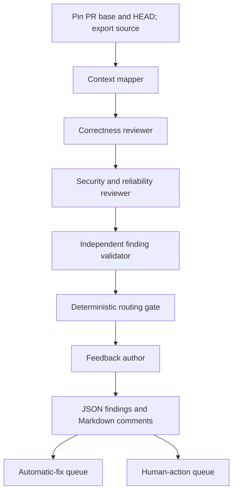

# Workflow 3: source code review

Workflow 3 reviews an existing GitHub pull request and produces actionable feedback
for a development agent and a human reviewer. It is independent of planning and
delivery: no Jira ticket, approved plan, CI result or delivery manifest is required.

It reads source; it does not fix code, execute tests, assess requirements compliance,
check deployment readiness, approve a PR or merge it. GitHub publication is a separate,
explicit operation. The default workflow writes local artifacts only.

See the [modular source and deployment guide](../build-and-install.md) for shared modules,
bundling, validation-only commands and source/bundle tests. Do not install the local
`workflows/source_review.py` entry point by copying it directly.

## Agent stages



1. **Context mapper** accounts for every changed file, classifies source/test versus
   out-of-scope material, identifies callers and sensitive boundaries.
2. **Correctness reviewer** traces changed behavior, edge cases, compatibility and
   test-source defects. Findings need a concrete reachable failure scenario.
3. **Security reviewer** independently examines authorization, sensitive data,
   transactions, concurrency and resource lifetime.
4. **Finding validator** re-reads source, checks guards and base/head behavior,
   rejects speculation, deduplicates shared root causes and reassesses fix eligibility.
   Every candidate must receive an explicit acceptance, rejection or duplicate decision.
5. **Feedback author** explains the accepted findings for development. It cannot change
   routing or severity; canonical evidence and routing are rendered by Python.

The specialist agents have separate contexts and are instructed not to consult each
other's findings. They currently execute **sequentially**, keeping CAO step ordering
predictable and limiting resource contention on a shared server. Independence does not
require simultaneous execution. Parallel scheduling is not implemented in this version.

## Routing policy

A finding is `AUTO_FIX` only if **all** these conditions hold:

- Severity is `LOW` or `MEDIUM`.
- Source evidence substantiates a PR-introduced or worsened defect.
- Confidence is at least **0.90** (for both low and medium severity).
- Intended behavior is clear from source contracts and usage.
- The fix is local and bounded.
- A specific deterministic verification method is available to the fixer.
- Neither the finding nor the mapper identifies a protected boundary.

Otherwise the route is `HUMAN_REQUIRED`, with explicit reasons. Protected categories
include architecture, public API/event contracts, schema changes, authentication and
authorization, cryptography/secrets, data loss, concurrency/transactions, critical
business rules, infrastructure topology and significant dependency changes. The
mapper's file-level protected classification is conservative: it forces human handling
even if the reviewer claims a local fix is eligible.

Unsupported speculation is rejected, not automatically converted into a human defect.
Coverage uncertainties are recorded separately. A confirmed defect whose *fix* requires
judgment remains a finding and goes to a human.

The gate recomputes routing from validated fields, disregarding any agent-supplied route.
Model confidence is an estimate, not a calibrated probability or proof. Source semantics
and sensitive-boundary detection still depend on the agents; the gate enforces their
validated evidence fields rather than proving program correctness.

Examples:

| Finding | Route | Why |
|---|---|---|
| Off-by-one slice violates an explicit function contract | `AUTO_FIX` | Local change and focused regression test |
| Missing owner check in account access | `HUMAN_REQUIRED` | Authorization boundary, regardless of patch size |
| Caller expectations conflict about idempotency | `HUMAN_REQUIRED` | Intended behavior requires a decision |
| Suspicion contradicted by an existing guard | Rejected | No substantiated defect |

See [the policy](../policies/source-review.md) for the normative rules.

## Prerequisites

- A running CAO server, `cao` CLI and configured `claude_code` provider.
- Python 3.10+ for this workflow's code (the repository declares Python 3.14+).
- Git and GitHub CLI (`gh`) on the CAO server host.
- For GitHub mode, authenticated `gh` read access to the PR and Git HTTPS read access
  to its repository. Configure the Git credential helper separately if necessary;
  `gh auth setup-git` is one option. The workflow never changes credentials.
- The repository root and fixture paths must be accessible **on the server host**.

The initial live validation used the available CAO server and its Claude Code provider.
CAO's profile validator may warn that `fs_write` is unrecognized; the installed Claude
Code tool mapping supports it and live answer-file delivery exercises it. Do not solve
that warning by granting `execute_bash`, `*` or broader tools.

## Installation

From this branch/worktree's root:

```bash
bash .agentic-sdlc/cao/workflows/install_source_review.sh "$PWD"
```

The installer builds `sdlc_workflows/source_review.py` and its shared dependencies
into a standalone artifact, then validates and adds only:

- `~/.aws/cli-agent-orchestrator/workflows/source_review.py`
- `sdlc_source_mapper`, `sdlc_source_correctness`, `sdlc_source_security`,
  `sdlc_source_validator`, `sdlc_source_feedback` profiles.

It does not change `dev_plan`, `deliver`, their profiles or repository hooks. It refuses
to overwrite an existing Workflow 3 installation or existing source-review profiles.
This prevents an ordinary reinstall from replacing definitions another run may use.
Installation is not transactional across profile installs: if it fails partway through,
inspect the new names before retrying; do not delete unrelated profiles.

For an upgrade, wait for Workflow 3 runs to finish, archive the installed workflow,
and explicitly manage its five profiles before reinstalling. Never replace definitions
while another operator is using them. Other workflows do not need to be stopped.

## Review a GitHub PR

Use a fresh run ID for **every** invocation:

```bash
cao workflow run source_review \
  --run-id source-review-pr42-20260918-1 \
  --input repository_root="$PWD" \
  --input pr_url=https://github.com/OWNER/REPO/pull/42
```

Add `--detach` to submit without waiting. Monitor only your run:

```bash
cao workflow status source-review-pr42-20260918-1
cao workflow events source-review-pr42-20260918-1 --follow
cao workflow result source-review-pr42-20260918-1
```

`repository_root` controls where evidence is stored; its working tree is not the review
source. The workflow retrieves the PR into a **private bare object store**, compares
merge-base to pinned HEAD, and exports base/head files as plain data into an isolated
workspace. The PR may come from a fork. It neither checks out a branch in the developer
repository nor fetches into that repository's refs or index. Uncommitted edits are ignored.

The base tip and HEAD are checked again on completion. If either moved or the PR closed,
the artifact is `STALE` and must not be acted upon as the current review. Start a fresh run.

### Inputs

| Input | Meaning |
|---|---|
| `repository_root` | Required existing directory for run evidence |
| `pr_url` | GitHub.com PR URL for normal operation |
| `source_repository` | Local committed repository for fixture/offline mode |
| `base_sha` | Exact 40-character commit SHA; fixture mode only |
| `head_sha` | Exact 40-character commit SHA; fixture mode only |

Choose GitHub mode **or** local fixture mode. Mixing them is rejected. GitHub Enterprise,
SHA-256 Git repositories, configurable routing thresholds and automatic fixes are not
implemented in this version.

## Output and agentic development handoff

Artifacts are isolated by run ID and Git-ignored:

```text
.agentic-sdlc/runtime/source-review/<run-id>/
├── code-review.json       # canonical, routed feedback
├── comments.md           # concise review with commit-specific source links
├── publication.json      # optional GitHub review receipt
├── failure.json          # only if orchestration failed
├── objects.git/          # this run's private Git objects
└── workspace/
    ├── source/base/ and source/head/
    ├── diff.patch and snapshot.json
    ├── mapping.json and candidates.json
    ├── adjudication.json and routed-findings.json
    └── .agentic-sdlc/runtime/<role>/
        └── answer, raw output and stabilization evidence
```

Archive the complete run directory if durable audit retention is needed. No shared
`agentic-sdlc-records/<ticket>` directory is overwritten and there is no global “latest review.”

`code-review.json` includes:

- `schema_version`, `policy_version`, `run_id`;
- `snapshot`: PR identity, base/head/merge-base SHAs and changed paths;
- `status`: `REVIEWED` or `STALE` (neither means PR approval);
- `coverage_status`: `COMPLETE` or `INCOMPLETE`, with explicit `coverage_gaps`;
- `findings`, each with source location, severity, confidence, trigger, evidence,
  consequence, fix direction, verification method, eligibility fields and routing reasons;
- `queues.AUTO_FIX` and `queues.HUMAN_REQUIRED`: finding IDs;
- `comments_sha256`, binding the publication text to the artifact.

Each finding carries a `stable_id` and `reviewed_head_sha`. IDs hash PR identity, path,
symbol, category and failure scenario, excluding HEAD and line numbers. This preserves
IDs when only lines move. Reworded scenarios, renamed files/symbols or reclassified issues
can receive new IDs; there is no semantic cross-run reconciliation in this version.
Do not interpret an absent ID on re-review as proof that its defect was fixed.

A development agent should:

1. Require `status == REVIEWED`, assess coverage gaps, and verify its checkout matches
   `snapshot.head_sha`. Never automatically consume a stale or failed result.
2. Select findings listed in `queues.AUTO_FIX`, using their canonical evidence and
   verification method. Coverage gaps require assessment before claiming review completion.
3. Attempt only the bounded fix. Run verification in the development workflow.
4. Escalate to a human if scope expands, intended behavior is unclear, verification
   fails or the same finding persists. Human findings must not be auto-fixed.
5. Commit changes and start a **new review run** against the new PR HEAD. Track repeated
   findings by ID where stable, supplemented by human/development-agent comparison.

`HUMAN_REQUIRED` is Workflow 3's equivalent of Workflow 2's `DEVELOPER_REQUIRED` route.
The JSON contracts differ: do not pass this artifact straight into Workflow 2's existing
remediator. An adapter must select findings, preserve the SHA binding and map fields.
No existing delivery integration has been changed implicitly.

## Optional GitHub publication

Publication is a separate command and defaults to preview. It creates one `COMMENT`
review containing the finding comments and commit-specific source links. These are
**not inline diff threads**; base-side/deleted-code findings remain linkable without
inventing an inline anchor.

```bash
RUN_DIR=.agentic-sdlc/runtime/source-review/source-review-pr42-20260918-1

# Preview the exact request; no GitHub write.
python3 .agentic-sdlc/scripts/publish_source_review.py "$RUN_DIR"

# Explicitly post the reviewed feedback.
python3 .agentic-sdlc/scripts/publish_source_review.py "$RUN_DIR" --publish
```

The publisher requires GitHub pull-request write permission. It verifies the comments
hash, rechecks the open PR's base/HEAD, and uses an exact `commit_id` with `event=COMMENT`.
It never approves or requests changes on behalf of a human. It lists all review pages
and reuses a prior review carrying the same base/HEAD marker on retry. It stores the
receipt locally and uses a local exclusive lock to prevent concurrent publication of
the same run. After a process crash, inspect GitHub before removing `publication.lock`.
Serialize publication across different run directories for the same PR; the GitHub API
has no transactional compare-and-post/idempotency operation. A push can race the final
check, but the posted review remains bound to its original commit.

Reference: [GitHub's create-review API](https://docs.github.com/en/rest/pulls/reviews#create-a-review-for-a-pull-request).

## Local live fixture

The fixture contains a clearly bounded off-by-one regression and a missing authorization
check. It creates its own repository and never modifies an existing repository:

```bash
python3 agentic-sdlc-local-inputs/source-review/create_fixture.py /tmp/my-source-review-fixture
```

Use the returned paths and SHAs:

```bash
cao workflow run source_review \
  --run-id source-review-fixture-1 \
  --input repository_root="$PWD" \
  --input source_repository=/tmp/my-source-review-fixture \
  --input base_sha=BASE_SHA_FROM_FIXTURE \
  --input head_sha=HEAD_SHA_FROM_FIXTURE
```

Expected semantic outcome: the slice defect is eligible for `AUTO_FIX`; the missing
ownership check is `HUMAN_REQUIRED`. Agent wording, candidate counts and duplicate
handling may differ. Fixture artifacts cannot be published to GitHub.

## Isolation, limits and failure handling

- Each invocation exclusively creates its run directory. **Resume/reuse of a run ID is
  deliberately refused** to avoid replacing evidence or reusing partial snapshots.
  After cancellation/failure, keep the evidence and use a fresh ID.
- PR source never supplies active hooks or agent settings. Agent-control files are
  excluded; symlinks and submodules are not materialized. Shell, network and subagent
  tools are not granted to reviewer profiles. A generated trusted hook allows writes
  only inside that run workspace's answer-artifact tree.
- The hook is a write guard, not an OS-level read sandbox. Review agents run under the
  configured provider account and inherit its global configuration. Use a dedicated
  provider account/container if hostile-repository isolation is required.
- Both snapshots are UTF-8 text exports. Binary/non-UTF8 files, control files, symlinks,
  submodules, files over 2 MB and exports exceeding 100 MB per tree create coverage gaps.
  A diff over 2 MB fails explicitly instead of silently truncating. Repositories with
  excluded files can be `INCOMPLETE` even if no source finding is reported.
- `COMPLETE` means no gaps were reported within the source-only review, not proof of
  correctness. An empty findings array can coexist with `INCOMPLETE`.
- Agent answers use Workflow 1's proven file-stabilization protocol. Incomplete execution
  never becomes an empty review. JSON/contract defects get one repair attempt; execution
  failure writes `failure.json` and causes CAO failure.
- Only this workflow's step terminals are cleaned up. No CAO server restart, shared
  terminal cleanup or developer checkout modification is performed.

## Verification

```bash
python3 -m unittest discover -s tests -v
bash -n .agentic-sdlc/cao/workflows/install_source_review.sh
```

The tests cover routing overrides, contracts, validation accounting, deduplication,
source export from real Git commits, concurrent dirty-checkout preservation, write-guard
symlink escapes, the five-stage pipeline, coverage propagation, stale/tampered publication,
publication retries and failed-run evidence. Existing hook tests need local socket access.

The live fixture exercises CAO/provider integration; it is not a substitute for the
regression suite or an evaluation of review accuracy on representative real PRs.

See the [implementation verification record](../verification/source-review-live.md) for test and live-run evidence.
