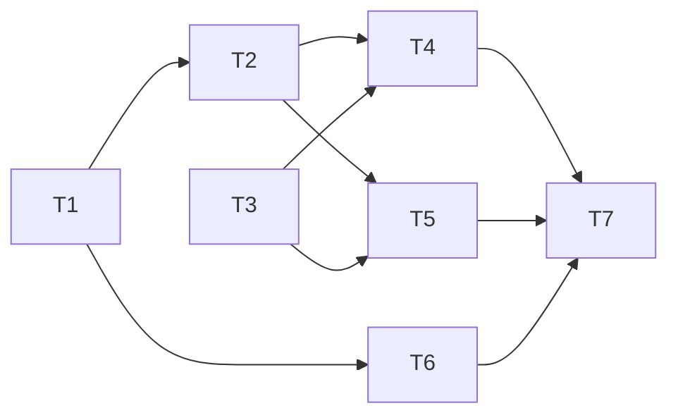

# Development Plan — PAY-DEMO-001

## Metadata

- Jira ticket: `PAY-DEMO-001` ("Make payment callbacks idempotent")
- Repository: `/home/dad/AIProjects/awscao_learning`
- Base branch: `main`
- Repository baseline SHA: `109a0a79b0f37b4a05f93b90e34e56c1e4b79207`
- Planning Context: `.agentic-sdlc/runtime/PAY-DEMO-001/plan-PAY-DEMO-001-24/context/normalized/planning-context-v1.json` (schema_version 1.0, validated)
- Planning Analysis: `.agentic-sdlc/runtime/PAY-DEMO-001/plan-PAY-DEMO-001-24/analysis/planning-analysis-v1.md`
- Developer guidance: none was supplied for this run.
- Plan revision: round 1 (initial draft; no reviewer findings addressed yet)

> This plan is immutable once presented for human approval. Its SHA-256 and approval state are stored separately. Independent agent-review evidence is stored in `plan-review.json` and is bound to the SHA-256 of the exact plan content reviewed.

## Source references

### Jira
- `JIRA:PAY-DEMO-001`, "Make payment callbacks idempotent" (content digest `63d3b4f5bb73aa0551796a3c8a695861353082deb9436a824a9c80ae2e339991`): Description, Scope, Acceptance Criteria AC-1 to AC-3.

### Confluence
- `CONF:4812`, "Payment Callback Processing" (digest `e2524c60bd64cb542a9eb23a6b89cd95c453ffa073405d8497c39e381778ea43`): Background, Functional requirements paragraphs 1 to 3, Compatibility, Observability.
- `CONF:4934`, "Payment Service Architecture" (digest `01527c41aff931406eabd25ddc9c5a7867df34eba70c2ba2f774d29ad3049064`): Persistence, Relevant components, Transaction model paragraphs 1 and 2, Constraints paragraphs 1 to 5.

### Repository evidence (baseline `109a0a7`)
- `app/payment_service/payment_service.py:23-27`: `process_callback` ignores the result of `record_if_new` and always calls `fulfil()`.
- `app/payment_service/repository.py:17-43`: SQLite `processed_callbacks` table with `provider_event_id TEXT PRIMARY KEY` and `payment_id TEXT NOT NULL`; `record_if_new` catches every `sqlite3.IntegrityError`; no release method.
- `app/payment_service/callback_controller.py:18-24`: always returns `{"status": "ok", "payment_id": ...}`.
- `app/payment_service/fulfilment_service.py`: in-memory ledger; never raises.
- `app/tests/test_payment_service.py`: four existing tests (AC-1, AC-2, AC-3 baseline).
- `app/README.md`: test command `python3 -m unittest discover -t app -s app/tests -v`.

## Problem statement

Payment providers can send the same callback more than once. Each callback carries a provider event ID that is stable across retransmissions. A repeated provider event must not trigger duplicate fulfilment (Planning Context problem statement; JIRA Description; CONF:4812 Background).

At the baseline, `PaymentService.process_callback` writes a claim row keyed by the provider event ID but ignores whether the write was new, so every duplicate runs fulfilment again. There is also no way to release a claim when fulfilment fails, the repository treats any integrity error (including a `NOT NULL` violation) as a duplicate, duplicates are not distinguishable in the logs, and per-request repository construction (CON-5) is not expressed anywhere in production code.

The change makes the existing persistence-layer uniqueness constraint the gate for fulfilment, adds a release path that reuses that same constraint on retry (delete, then re-insert), logs duplicates distinctly, and adds a request-scoped entry point that builds a fresh `PaymentRepository` for each request. The provider-facing response is unchanged.

## Scope

### In scope
- The payment callback processing path: `CallbackController` → `PaymentService` → `PaymentRepository` / `FulfilmentService` (scope.in; CONF:4934 Relevant components).
- Gating fulfilment on the claim result of the uniqueness-constrained insert (AC-1, FR-1, FR-4, NFR-2, CON-1).
- Releasing the claim (deleting the claim row) when fulfilment fails after a successful claim, so a provider retry can re-claim through the same constraint (FR-2, CON-4).
- Correctly telling duplicate-key violations apart from other claim-write failures (FR-3).
- Distinct log records for duplicates and first deliveries (AC-3, FR-6, NFR-3).
- A production request-scoped entry point that constructs a `PaymentRepository` per request (CON-5).
- Tests for all of the above, including sequential, in-flight and concurrent duplicates.
- Continued use of the existing SQLite-backed `PaymentRepository` as the PostgreSQL stand-in (CON-6; scope.in).

### Out of scope
- Provider adapter public interfaces (CON-7; scope.out). None exist in the repository.
- Introducing an actual PostgreSQL dependency (CON-6; scope.out).
- A distributed lock service, or any application-level lock, for idempotency (CON-1, CON-2; scope.out).
- Automatic reconciliation or timeout recovery for an event left permanently claimed by a crash after acceptance but before its outcome is durably recorded (accepted known limitation, CONF:4934 Constraints paragraph 4).
- Automatic recovery of a payment whose original claimant failed and was released after an in-flight duplicate had already been acknowledged, so no further callback arrives (accepted known limitation, CONF:4934 Constraints paragraph 5).
- Inventing payment state-transition code or tables (see OQ-1 below).
- Any HTTP framework, status-code mapping or change to the response body.

## Acceptance criteria

| ID | Criterion | Planned implementation | Planned verification |
|---|---|---|---|
| AC-1 | Repeated callbacks carrying the same provider event ID must not cause duplicate fulfilment. | T2: `process_callback` calls `fulfil()` only when `record_if_new` returns `True` (the INSERT under the `provider_event_id` PRIMARY KEY succeeded). A `False` result returns `ProcessingResult(fulfilled=False)` without fulfilment. Concurrent and in-flight duplicates are rejected by the same constraint on separate per-request connections (T1, T3). Covers FR-1, FR-4, NFR-2. | Existing `test_duplicate_callback_does_not_refulfil` (sequential). New T5 tests: in-flight duplicate while the original is blocked inside fulfilment; N concurrent deliveries released together by a barrier, each with its own repository; assert `fulfilment_count == 1`. |
| AC-2 | Existing provider-facing HTTP response behaviour must remain backward compatible. | `CallbackController.handle` is not modified; it keeps returning `{"status": "ok", "payment_id": ...}` regardless of `ProcessingResult.fulfilled`. Duplicates (including in-flight ones) return normally, so they get the identical success body (FR-5, NFR-1). Failure paths keep propagating exceptions exactly as today. The new request-scoped entry point (T3) returns the controller's dict unchanged. | Existing `test_first_callback_fulfils_once` and `test_response_shape_is_identical_for_new_and_duplicate`. New T5 assertions that every concurrent and in-flight response equals the first-delivery response. T4 asserts the request-scoped handler returns exactly the controller's dict. |
| AC-3 | Duplicate callback attempts must be observable in application logs. | T2: the `payment_service.payment_service` logger emits an INFO record containing the word "duplicate", the provider event ID and the payment ID for every rejected duplicate. The first-delivery record keeps its existing wording, which does not contain "duplicate" (FR-6, NFR-3). | Existing `test_duplicate_is_distinguishable_in_logs`. New T4 test: the first-delivery log does not contain "duplicate". New T5 test: N concurrent deliveries produce exactly N-1 duplicate records and one processed record. |

### Other requirement and constraint mapping

| ID | Planned implementation | Verification |
|---|---|---|
| FR-1 | Claim-gated fulfilment (T2). | AC-1 tests. |
| FR-2 | T1 adds `PaymentRepository.release_claim(provider_event_id)` (`DELETE ... WHERE provider_event_id = ?` then `commit()`). T2 wraps `fulfil()` in `try/except Exception`; on failure it calls `release_claim`, logs, and re-raises the original exception so the delivery fails as today and the provider retries. The retry re-inserts through the same PRIMARY KEY. | T4: failing-fulfilment double raises once; the exception propagates; the claim row is gone; the retry fulfils once; total successful fulfilments = 1. T6: `release_claim` removes the row and a later `record_if_new` returns `True`. |
| FR-3 | T1: `record_if_new` returns `False` only for a uniqueness violation on `processed_callbacks.provider_event_id`; any other `IntegrityError` (e.g. `NOT NULL` on `payment_id`) and any other `sqlite3` error propagate. T2 does not call `release_claim` when the claim itself fails, because the claim call sits outside the fulfilment `try`. | T6: `record_if_new(evt, None)` raises `sqlite3.IntegrityError` and leaves no row. T4: a `None` payment ID propagates from `process_callback`, with no fulfilment and no release; a stub repository raising `sqlite3.OperationalError` from `record_if_new` propagates with no fulfilment and no `release_claim` call; a subsequent valid retry fulfils once. |
| FR-4 | Covered by the constraint: the original claim is committed before fulfilment starts, so a concurrent duplicate's INSERT on its own connection fails with the uniqueness error regardless of timing. | T5 in-flight test (deterministic, uses `threading.Event`). |
| FR-5 | Duplicates return normally through the unchanged controller. | T5 in-flight test asserts the duplicate response equals the first-delivery response. |
| FR-6 / NFR-3 | Distinct duplicate log record (T2). | AC-3 tests. |
| NFR-1 | Controller unchanged. | AC-2 tests. |
| NFR-2 | Uniqueness constraint on separate per-request connections; no lock. | T5 barrier-based concurrency test. |
| CON-1 / CON-2 | The only idempotency mechanism is the existing `provider_event_id` PRIMARY KEY. No `threading.Lock`, no lock service, no status column. | Review of the diff; T7 deterministic check that `app/payment_service/` contains no `threading`/`Lock` imports. |
| CON-3 | Reuses the existing `sqlite3` connection and explicit `commit()`/`rollback()`; no new dependencies. | Diff review; stdlib-only imports. |
| CON-4 | Retry after release is delete-then-reinsert through the same PRIMARY KEY. No `UPDATE ... WHERE status = ...` and no status column is added. | T4 release-and-retry test; T6 repository test; diff review for absence of `UPDATE`. |
| CON-5 | T3 adds `CallbackRequestHandler`, which builds a fresh `PaymentRepository(db_path)`, `PaymentService` and `CallbackController` for each `handle(body)` call and closes the repository in `finally`. | T4: two consecutive requests use two distinct repository instances, and each is closed. T5 concurrency tests run through this handler, one connection per thread. |
| CON-6 | SQLite backend, table and schema stay unchanged. Only methods are added or tightened. | Diff review: the `CREATE TABLE` statement is byte-for-byte unchanged; no new dependency. |
| CON-7 | No provider adapter interface is touched. | Diff review. |
| CON-8 | Claim gating, release and fulfilment coordination all live in `PaymentService.process_callback`. | Diff review; T4 tests exercise `PaymentService`. |

## Assumptions and unresolved questions

### Assumptions and decisions
- **A1 (OQ-1, non-blocking).** De-duplication is applied to fulfilment, which is the only side effect in the callback path at the baseline. The repository has no payment state transitions or state storage, so there is nothing else to protect. Because the claim gates the entire processing path after it, any payment-processing step later added inside the gated branch of `process_callback` is also protected. No state-transition code is invented.
- **A2 (OQ-2, non-blocking).** The in-repository "provider-facing HTTP response contract" is the dict returned by `CallbackController.handle`. It is `{"status": "ok", "payment_id": <id>}` for first deliveries and for duplicates. Processing failures propagate as exceptions, as they do today, and the host HTTP layer (not in this repository) turns them into a non-success response that makes the provider retry. The plan changes neither behaviour.
- **A3 (OQ-3 and CD-1, non-blocking).** The plan meets the stronger "must" wording of AC-3, so the CD-1 precedence question does not change the design. Working log specification, matching the existing test: logger `payment_service.payment_service`, level INFO, message `"duplicate callback ignored for provider_event_id=%s payment_id=%s"`. The first-delivery message stays `"callback processed for provider_event_id=%s"` with `payment_id=%s` appended. Level INFO is chosen because duplicates are expected under normal provider retry behaviour.
- **A4 (OQ-4, default proposed; see HD-1).** If `release_claim` itself raises after a fulfilment failure, `PaymentService` logs the release failure at ERROR with the provider event ID (using `logger.exception`) and re-raises the **original fulfilment exception**. The release error remains attached as the exception's `__context__`. The event then stays claimed and later retries are treated as duplicates; this is the same end state as the accepted crash-before-outcome limitation. There is no automatic recovery.
- **A5 (CON-5 wiring).** The sources require per-request construction but do not say where it lives. The plan adds a small request-scoped entry point `app/payment_service/request_handler.py` (`CallbackRequestHandler(db_path, fulfilment_service)`), so the constructor signatures of `PaymentService`, `CallbackController` and `PaymentRepository` do not change. `PaymentService` and `CallbackController` remain per-request objects that receive their repository by injection. `FulfilmentService` is shared, because it is the downstream side effect and not the idempotency store. The existing tests that build one repository directly in `setUp` stay as sequential unit tests of the classes; they do not use the production entry point.
- **A6 (CON-6 interpretation).** "Kept as-is" is read as: keep the SQLite backend, the `processed_callbacks` table and schema, and its role as the PostgreSQL stand-in. Adding `release_claim`, narrowing the duplicate detection and rolling back after a failed insert are behaviour changes on the same table. They are not a backend replacement. Connection options (journal mode, timeout, `check_same_thread`) are left at their defaults.
- **A7 (duplicate detection on SQLite).** The baseline runs on Python 3.10, so `sqlite3.IntegrityError.sqlite_errorname` (added in 3.11) cannot be relied on. The duplicate check matches SQLite's message for this constraint, `"UNIQUE constraint failed: processed_callbacks.provider_event_id"`, and re-raises any other `IntegrityError`. The implementation should keep the check in a single private helper so a PostgreSQL implementation can switch to SQLSTATE `23505` plus the constraint name.
- **A8 (external dependencies from context).** Provider event IDs are stable across retransmissions, and providers retry after a failed delivery. The repository cannot verify either.
- **A9.** Adding the `payment_id` to the processed log line is an additive change to log content and not part of the provider-facing contract.

### Unresolved human decisions

| ID | Decision | Blocking? | Plan default |
|---|---|---|---|
| HD-1 | OQ-4: required behaviour when releasing the claim after a fulfilment failure itself fails. | No. The sources do not define it, and the default fails safe against duplicate fulfilment. | A4: log at ERROR, re-raise the original fulfilment error, leave the event claimed (no auto-recovery), and treat it like the accepted crash limitation. A human may instead require, for example, a follow-up reconciliation ticket. That would be additive and would not change this design. |
| HD-2 | OQ-1: whether steps other than fulfilment must be de-duplicated. | No. No such steps exist at the baseline. | A1. |
| HD-3 | OQ-2 / OQ-3 / CD-1: confirmation of the working response and log specifications. | No. | A2, A3. |

No blocking open question or contradiction exists in the Planning Context. No part of the design depends on an unresolved blocking item.

## Repository / impact analysis

- **Affected components:**
  - `app/payment_service/repository.py`, `PaymentRepository`:
    - new `release_claim(provider_event_id: str) -> bool` (DELETE and commit; returns whether a row was removed);
    - `record_if_new` narrows its duplicate detection and calls `self._conn.rollback()` before returning `False` or re-raising, so the failed insert's implicit transaction does not keep holding the write lock on the shared database file;
    - schema and connection options unchanged.
  - `app/payment_service/payment_service.py`, `PaymentService.process_callback`: claim gating, release on fulfilment failure, duplicate and failure logging, `fulfilled=False` for duplicates. The obsolete "Known gap" note in the module docstring is replaced by a description of the idempotency behaviour.
  - `app/payment_service/request_handler.py` (new): `CallbackRequestHandler`, the production request-scoped composition point (CON-5).
  - `app/tests/test_payment_service.py`: new service-level tests (FR-2, FR-3, OQ-4, log distinguishability, CON-5 wiring). The existing four tests are kept unchanged.
  - `app/tests/test_callback_concurrency.py` (new): in-flight and concurrent duplicate tests through `CallbackRequestHandler`.
  - `app/tests/test_repository.py` (new): repository-level tests.
  - `app/README.md`: a short note on the request-scoped entry point. The test command does not change.
- **Unchanged:** `callback_controller.py` (response contract), `models.py` (`ProcessingResult.fulfilled` already exists), `fulfilment_service.py` (test doubles subclass it in tests only).
- **Existing patterns to reuse:**
  - constructor dependency injection;
  - module docstring plus `from __future__ import annotations` plus type hints;
  - module-level `logging.getLogger(__name__)` with %-style arguments;
  - raw `sqlite3` SQL with explicit `commit()`;
  - `IntegrityError` as the uniqueness signal;
  - `unittest` with temp-dir SQLite files.
- **Dependencies:** Python stdlib only (`sqlite3`, `logging`, `threading` in tests only). No new packages. Call chain `CallbackController` → `PaymentService` → (`PaymentRepository`, `FulfilmentService`).
- **Persistence/schema:** no schema change and no migration. The existing `processed_callbacks` rows stay valid: a row now means "claimed" (in flight or completed), and releasing it removes the row.
- **Security/authorization:** no change to authentication or authorization boundaries. Classifying constraint violations more strictly (FR-3) stops malformed payloads from being silently acknowledged as duplicates. Logs contain provider event and payment identifiers, which the baseline already logs; no payload bodies or secrets are logged.

## Proposed design

### Idempotency primitive
The existing `provider_event_id TEXT PRIMARY KEY` on `processed_callbacks` is the only idempotency mechanism (CON-1). A committed row is the claim. Each request uses its own connection (CON-5), so concurrent inserts race inside SQLite and exactly one commits; the others receive the uniqueness `IntegrityError` (NFR-2). There are no locks or status columns (CON-2, CON-4).

### `PaymentRepository` (T1)
```python
_DUPLICATE_EVENT_MESSAGE = "UNIQUE constraint failed: processed_callbacks.provider_event_id"

def record_if_new(self, provider_event_id, payment_id) -> bool:
    try:
        self._conn.execute("INSERT INTO processed_callbacks ... VALUES (?, ?)", (...))
        self._conn.commit()
        return True
    except sqlite3.IntegrityError as exc:
        self._conn.rollback()
        if self._is_duplicate_event(exc):
            return False
        raise                      # e.g. NOT NULL on payment_id -> failure to claim (FR-3)
    # other sqlite3 errors (OperationalError, ...) propagate unchanged (FR-3)

def release_claim(self, provider_event_id) -> bool:
    cur = self._conn.execute("DELETE FROM processed_callbacks WHERE provider_event_id = ?", (provider_event_id,))
    self._conn.commit()
    return cur.rowcount == 1
```
The sketch is illustrative; the implementer follows module conventions. For non-`IntegrityError` failures, `rollback()` should also be attempted (without masking the original error) so a failed request does not leave an open transaction before `close()`.

### `PaymentService.process_callback` (T2)
```python
claimed = self._repository.record_if_new(event.provider_event_id, event.payment_id)
# claim-write failure other than duplicate propagates here: no release, no fulfilment (FR-3)
if not claimed:
    logger.info("duplicate callback ignored for provider_event_id=%s payment_id=%s", ...)
    return ProcessingResult(payment_id=event.payment_id, fulfilled=False)
try:
    self._fulfilment_service.fulfil(event.payment_id)
except Exception:
    try:
        self._repository.release_claim(event.provider_event_id)
    except Exception:
        logger.exception("failed to release claim after fulfilment failure for provider_event_id=%s", ...)
    else:
        logger.warning("fulfilment failed; claim released for retry for provider_event_id=%s", ...)
    raise                          # original fulfilment exception (FR-2, A4)
logger.info("callback processed for provider_event_id=%s payment_id=%s", ...)
return ProcessingResult(payment_id=event.payment_id, fulfilled=True)
```
Note on the bare `raise` inside the outer `except`: after the inner `try/except` has handled a release error, a bare `raise` in the outer handler re-raises the original fulfilment exception. The implementer must make sure the original exception is the one that propagates. Capturing it (`except Exception as fulfil_error: ... raise fulfil_error`) is an acceptable explicit form, and T4 verifies the behaviour.

### Request-scoped entry point (T3)
```python
class CallbackRequestHandler:
    def __init__(self, db_path, fulfilment_service): ...
    def handle(self, body):
        repository = PaymentRepository(self._db_path)          # fresh connection per request (CON-5)
        try:
            service = PaymentService(repository, self._fulfilment_service)
            return CallbackController(service).handle(body)    # response dict unchanged (AC-2)
        finally:
            repository.close()
```
An optional `repository_factory` constructor parameter, defaulting to `PaymentRepository`, lets T4 observe per-request construction without patching.

### Behaviour matrix

| Situation | Claim result | Fulfilment | Response | Log |
|---|---|---|---|---|
| First delivery | inserted | runs once | `{"status":"ok",...}` | INFO "callback processed ..." |
| Duplicate after completion | uniqueness violation | skipped | identical `ok` | INFO "duplicate callback ignored ..." |
| Duplicate while original in flight | uniqueness violation (row committed before fulfilment) | skipped | identical `ok` | INFO "duplicate ..." |
| Fulfilment fails after claim | inserted, then deleted | raised | exception propagates (as today) | WARNING "claim released" |
| Retry after released claim | re-inserted through same PRIMARY KEY | runs | `ok` | INFO "processed" |
| Claim write fails, not a duplicate | exception | not run; no release | exception propagates | none added (error surfaces to caller) |
| Release fails after fulfilment failure | row remains | raised | original exception propagates | ERROR with traceback (HD-1) |

## Implementation tasks

| Task | Goal | Depends on | Parallelizable |
|---|---|---|---|
| T1 | `repository.py`: add `release_claim`; narrow duplicate detection in `record_if_new` to the `provider_event_id` uniqueness violation through a private helper; roll back after a failed insert; update the docstring. Schema and connection options unchanged. (FR-2, FR-3, CON-1, CON-4, CON-6) | - | Yes, with T3 |
| T2 | `payment_service.py`: claim-gated fulfilment, release on fulfilment failure with the original error re-raised, release-failure handling per A4, duplicate, processed and failure log records per A3, `fulfilled=False` for duplicates; replace the "Known gap" docstring. (AC-1, AC-3, FR-1, FR-2, FR-3, FR-4, FR-6, CON-8) | T1 (uses `release_claim` and the narrowed `record_if_new` semantics) | No |
| T3 | New `request_handler.py`: `CallbackRequestHandler` builds a fresh `PaymentRepository` per `handle()` call and closes it in `finally`; optional `repository_factory` for tests; add a brief `app/README.md` note. (CON-5, AC-2) | - (uses existing constructors only) | Yes, with T1 |
| T4 | Extend `app/tests/test_payment_service.py`: fulfilment-failure release and retry; release-failure propagation and ERROR log (stub repository); `None` payment ID and stub `OperationalError` claim failures (no fulfilment, no release, valid retry succeeds); first-delivery log has no "duplicate"; `CallbackRequestHandler` builds and closes a distinct repository per request and returns the controller dict unchanged. Keep the four existing tests unchanged. | T2, T3 | Yes, with T5 and T6 (separate files) |
| T5 | New `app/tests/test_callback_concurrency.py`: (a) deterministic in-flight duplicate, where a blocking fulfilment double waits on `threading.Event`, the duplicate is sent through the handler from the main thread and returns the identical `ok` response, then the original is released; total fulfilments = 1. (b) N=8 threads start `handler.handle()` at the same time behind a `threading.Barrier`, each with its own repository; assert fulfilments = 1, all responses equal, no exceptions, exactly N-1 duplicate log records. Pre-create the table in `setUp`; use a lock-free-safe counting double (CPython `list.append` is atomic) or the existing `FulfilmentService`. (AC-1, AC-2, AC-3, FR-4, FR-5, NFR-2, CON-5) | T2, T3 | Yes, with T4 and T6 |
| T6 | New `app/tests/test_repository.py`: first insert returns `True`; same ID returns `False` and leaves one row; `None` `payment_id` raises `IntegrityError` and leaves no row; `release_claim` removes the row and returns `True`, a second release returns `False`; `record_if_new` after release returns `True` (delete-then-reinsert, CON-4); a second connection can insert a different event immediately after a duplicate rejection on the first (rollback releases the write lock). (FR-2, FR-3, CON-4) | T1 | Yes, with T4 and T5 |
| T7 | Verification pass: run the full suite; run the concurrency module repeatedly (e.g. 20 times) to detect flakiness; run the CON-1/CON-2/CON-4 deterministic checks listed below; confirm `callback_controller.py`, `models.py`, `fulfilment_service.py` and the `CREATE TABLE` statement are unchanged against the baseline. | T4, T5, T6 | No |

## Dependencies and parallelisation



- Wave 1: T1 and T3 in parallel (different files, no shared interface).
- Wave 2: T2 (needs T1). T6 can start as soon as T1 is done.
- Wave 3: T4 and T5 in parallel (separate test files), together with T6 if not already done.
- Wave 4: T7.
- In single-implementer mode, execute in the order T1, T2, T3, T6, T4, T5, T7.

## Developer verification strategy

- **Build/static checks:** `python3 -m py_compile app/payment_service/*.py app/tests/*.py`. No linter or type checker is configured in the repository, and none is introduced.
- **Unit tests:** `python3 -m unittest discover -t app -s app/tests -v` must pass in full, including the four pre-existing tests. The two tests expected to fail at the baseline (`test_duplicate_callback_does_not_refulfil`, `test_duplicate_is_distinguishable_in_logs`) must now pass. New tests from T4 and T6 cover FR-2, FR-3, OQ-4 handling, log distinguishability, repository semantics and CON-5 wiring.
- **Integration tests:** T5 exercises the full production path (`CallbackRequestHandler` → `CallbackController` → `PaymentService` → a real SQLite file with one connection per thread → `FulfilmentService`). Both the deterministic in-flight test and the barrier-based concurrent test must pass. Run the module 20 times in a loop (`for i in $(seq 20); do python3 -m unittest discover -t app -s app/tests -p 'test_callback_concurrency.py' || break; done`) with no failures, to catch lock-timeout flakiness.
- **Other deterministic checks:**
  - `grep -nE 'threading|Lock' app/payment_service/*.py` returns nothing (CON-1, CON-2; `threading` is allowed in tests only).
  - `grep -niE 'UPDATE|status' app/payment_service/repository.py` finds no status column and no conditional `UPDATE` (CON-4).
  - `git diff 109a0a7 -- app/payment_service/callback_controller.py app/payment_service/models.py app/payment_service/fulfilment_service.py` is empty (AC-2, NFR-1).
  - The `CREATE TABLE IF NOT EXISTS processed_callbacks` statement is unchanged (CON-6).
  - No new third-party imports and no requirements file.

## Risks and compatibility / rollout considerations

- **API/backward compatibility:** the controller and the response dict are unchanged. `ProcessingResult.fulfilled` becomes `False` for duplicates; the controller does not read it, and no other caller exists in the repository. `PaymentRepository.record_if_new` now raises for non-duplicate integrity errors where it used to return `False`. This is deliberate (FR-3), and the only caller is `PaymentService`. No public constructor signature changes. `CallbackRequestHandler` is additive.
- **Persistence/migration:** no schema change and no migration. Rows written before deployment are treated as completed claims, which is correct because the baseline always ran fulfilment after writing a row.
- **SQLite concurrency (tests):**
  - `check_same_thread=True` requires one connection per thread, which the per-request handler provides.
  - The default rollback journal with a 5 s busy timeout serializes writers. The rollback after a rejected insert (T1) prevents a rejected request from keeping the write lock.
  - Mitigations: modest thread count (8), table pre-created in `setUp`, and the 20-run flakiness loop in T7. Any `OperationalError` that does occur under contention is correctly classified as a failure to claim (FR-3), not as a duplicate.
- **Message-based duplicate detection (A7):** it depends on SQLite's error text. This is acceptable for the stand-in, and it is isolated in one helper and covered by T6. A future PostgreSQL implementation must switch to SQLSTATE plus the constraint name.
- **Accepted limitations (out of scope, unchanged):**
  - A crash between claim and outcome leaves an event claimed permanently.
  - An in-flight duplicate acknowledged before the original fails and releases means no further callback arrives, so the payment is not fulfilled without reconciliation.
  - The HD-1 default (release failure) leads to the same stuck-claim end state; it is logged at ERROR with the event ID so an operator can reconcile manually.
- **Retry after release is racy by design:** after a release, a concurrent retry and a late duplicate both try to re-insert under the same PRIMARY KEY, so exactly one fulfils. No double fulfilment is possible.
- **Observability/operations:**
  - New INFO duplicate records.
  - A WARNING record for released claims.
  - An ERROR record with traceback for release failures.
  - No configuration changes. Log volume rises only in proportion to provider retransmissions.
- **Rollout:** a single-service code change with no data migration and no feature flag needed. Rollback means reverting the commit; claim rows remain compatible with the baseline code.

## Independent plan review

Final independent review evidence is maintained in the sibling `plan-review.json` artifact and is cryptographically bound to this plan's SHA-256. The plan itself is not modified after the passing review merely to embed the review result.
